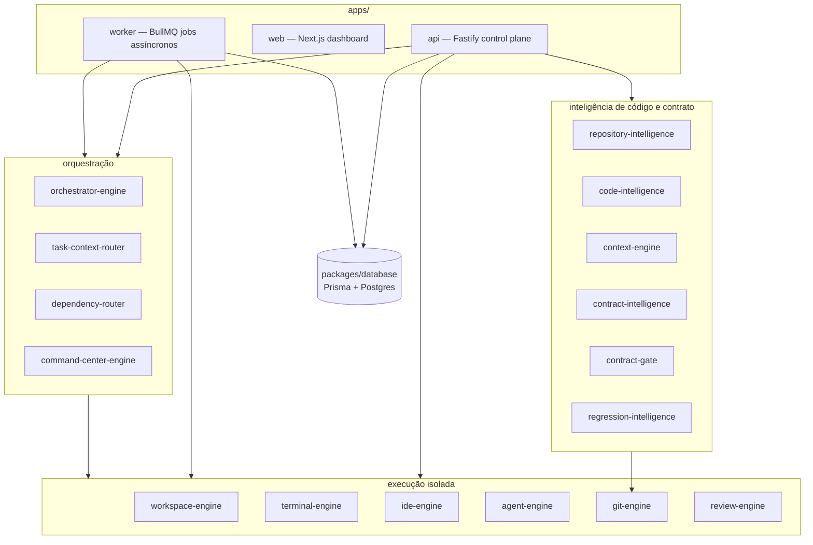
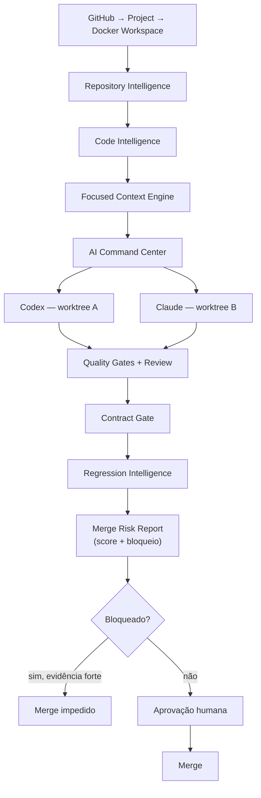
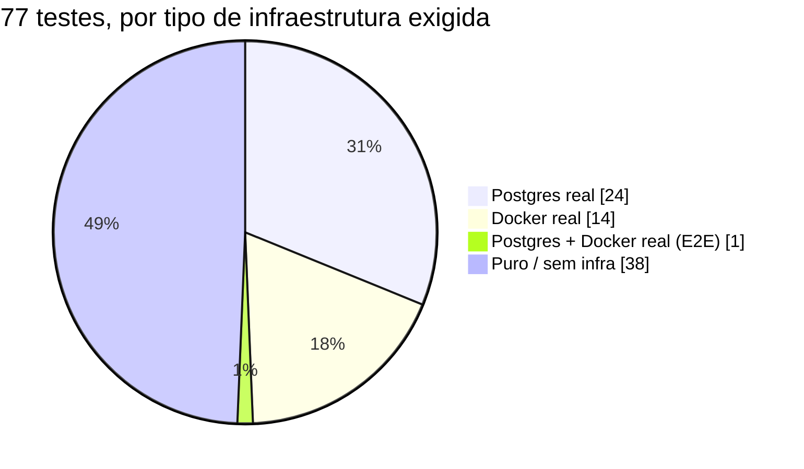
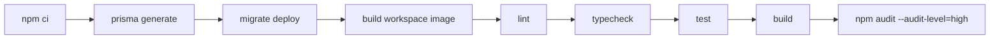

# Oliveira DevCloud

[](https://github.com/RobersonCodes/Oliveira-DevClaud/actions/workflows/ci.yml)


## Introdução

Estou construindo a Oliveira DevCloud como uma plataforma self-hosted de desenvolvimento remoto: em
vez de cada desenvolvedor rodar tudo na própria máquina, eu subo um workspace Docker isolado por
projeto, com terminal persistente, IDE no navegador e agentes de IA (Codex/Claude) trabalhando em
worktrees Git separadas — e nada é mergeado na branch principal sem passar por gates de qualidade,
um Contract Gate que compara contratos de API antes/depois, uma análise de regressão com score
determinístico, e aprovação humana explícita.

Não escrevi isso como uma prova de conceito que "funciona na minha máquina". Cada peça que descrevo
abaixo eu testei contra infraestrutura real — Postgres real, Docker real, um container real rodando
a imagem de workspace de verdade — porque foi assim que encontrei (e corrigi) os bugs mais sérios
deste projeto: eles só apareciam quando eu parava de confiar no código e começava a executá-lo.

<p align="center">
  
</p>

## Sumário

- [O que eu já entreguei](#o-que-eu-já-entreguei)
- [Números reais](#números-reais)
- [Arquitetura](#arquitetura)
- [Fluxo de Review & Merge](#fluxo-de-review--merge)
- [Capturas de tela](#capturas-de-tela)
- [Como eu preparo o ambiente local](#como-eu-preparo-o-ambiente-local)
- [Testes](#testes)
- [CI/CD](#cicd)
- [Segurança](#segurança)
- [Glossário](#glossário)
- [Documentação](#documentação)
- [Evolução do projeto](#evolução-do-projeto)
- [Contribuindo](#contribuindo)

## O que eu já entreguei

- **Workspaces Docker isolados** — cada workspace roda em container próprio, `CapDrop: ALL`,
  `no-new-privileges`, non-root, com limites reais de CPU/RAM/PIDs que eu verifiquei inspecionando o
  `HostConfig` do container de verdade, não só o código que monta a requisição.
- **Terminal persistente** — tmux dentro do container + WebSocket + xterm.js no navegador. Desconectar
  o navegador não mata o processo.
- **Web IDE** — code-server via proxy autenticado, sem expor o socket do Docker ao navegador.
- **Agentes multiagente** — Codex e Claude trabalham em Git worktrees isoladas, orquestrados por um
  DAG de steps com dependências.
- **Review & Merge com gates reais** — antes do merge, eu rodo quality gates (test/build/lint),
  comparo contratos HTTP entre baseline e candidato (Contract Gate), e calculo um score de regressão
  determinístico (Regression Intelligence) — só então um humano aprova.
- **Repository/Code/Contract Intelligence** — mapas de arquivos, símbolos, endpoints e dependências,
  cacheados por commit SHA, usados para dar contexto focado aos agentes antes de cada tarefa.

## Números reais

Não vou te pedir para acreditar — aqui está o que eu medi rodando os comandos, não o que eu acho que
é verdade:

| Métrica | Valor | Como eu validei |
|---|---|---|
| Testes passando | **77** em 10 arquivos | `npm test` contra Postgres real + Docker real |
| Pacotes no monorepo | 21 (`packages/*`) + 3 apps | `ls packages apps` |
| Linhas de TypeScript | ~6.700 | `wc -l` em `apps/**/*.ts(x)` e `packages/**/*.ts` |
| Migrations do Prisma | 2 | histórico consolidado + v2.5 (Notification/ActivityLog/Repository) |
| PRs mergeados nesta fase | 10 | todos com CI verde antes do merge, sem exceção |
| Bugs críticos de baseline encontrados e corrigidos | 16+ | ver `docs/V2.5-AUDIT.md` e a tabela abaixo |
| Commits | 24 | `git log --oneline \| wc -l` |

### Os bugs mais sérios que encontrei rodando o projeto pela primeira vez

Antes desta fase, o projeto tinha código para praticamente tudo — mas boa parte dele nunca tinha sido
executado de verdade. Eu só descobri isso ao tentar rodar `npm install && npm run build` do zero.
Alguns exemplos, porque "eu corrigi bugs" sozinho não convence ninguém:

| Bug | Sintoma | Causa raiz |
|---|---|---|
| `prisma generate` quebrava com 65+ erros | Todo `enum`/`generator`/`datasource` estava em uma linha só | Regressão do parser do Prisma para blocos de uma linha (`^6.19.3`) |
| Histórico de migrations nunca criava as tabelas base | `prisma migrate dev` falhava do zero contra Postgres real | A migration inicial só tinha `CREATE TABLE "Secret"` — o resto do schema nunca foi versionado |
| `npm run dev` nunca carregava `DATABASE_URL` | API subia, mas `/ready` sempre retornava erro de banco | `npm run dev -w <pkg>` roda com `cwd` dentro do workspace, não na raiz — `dotenv` procurava o `.env` no lugar errado |
| `git worktree add` falhava com `exec: invalid argument` | Só aparecia testando contra um container Docker real | Nenhum dos 9 pacotes que rodam `docker exec` desmultiplexava o stream — o SHA do commit vinha com bytes de cabeçalho binário grudados |
| A imagem Docker do workspace nunca buildava | `docker build` falhava sempre | `npm install -g yarn` conflitava com o yarn que a imagem base já trazia pré-instalado |

## Arquitetura



## Fluxo de Review & Merge

Este é o coração do projeto — a parte que decide se o trabalho de um agente de IA é seguro de
mergear:



Eu deixei o bloqueio automático deliberadamente conservador: só bloqueio com evidência forte (gate de
teste/build falho, conflito de merge não resolvido, endpoint removido com consumidor conhecido).
Heurísticas mais fracas — um símbolo removido, um módulo sensível tocado — aparecem no relatório para
revisão humana, mas nunca bloqueiam sozinhas. Prefiro um falso negativo ocasional a um sistema que
bloqueia tanto que os desenvolvedores aprendem a ignorá-lo.

## Capturas de tela

Todas as capturas abaixo são de uma sessão real: registrei um usuário de verdade, criei um projeto de
verdade, subi um workspace real (a imagem `oliveira-devcloud/workspace-node:1.0` de verdade) e abri um
terminal real conectado por WebSocket a esse container.

<table>
<tr>
<td width="50%">

**Login**


</td>
<td width="50%">

**Terminal real, conectado a um container real**


</td>
</tr>
<tr>
<td width="50%">

**Workspace Engine — isolamento em primeiro lugar**


</td>
<td width="50%">

**Orquestrações (Review & Merge v2.5)**


</td>
</tr>
</table>

> Encontrei, capturando essas telas, um bug real no terminal do navegador: o payload JSON do evento de
> input às vezes aparece ecoado como texto literal no terminal (`{"type":"input","data":"..."}`) em vez
> de ser só enviado pelo WebSocket. Não escondi isso — está registrado como pendência conhecida, não
> escondo bug atrás de captura de tela bonita.

## Como eu preparo o ambiente local

```bash
cp .env.example .env
docker compose up -d postgres redis
docker build -t oliveira-devcloud/workspace-node:1.0 infra/workspace-images/node
npm install
npm run db:generate
npm run db:migrate
npm run dev
```

`npm run dev` sobe `web` (3000), `api` (4000) e `worker` concorrentemente. Se você já tem um
PostgreSQL/Redis nativo ocupando `5432`/`6379` na máquina — foi exatamente o meu caso ao testar tudo
isso —, suba o `docker-compose.yml` em portas alternativas ou aponte `DATABASE_URL`/`REDIS_URL` do
`.env` para a instância existente.

## Testes

```bash
npm test          # vitest run — toda a suíte, uma vez
npm run test:watch
```

Rodo a suíte inteira contra **infraestrutura real**. Nada aqui é mock:



| Pacote/App | O que eu testo | Infra necessária |
|---|---|---|
| `packages/secret-manager` | Criptografia/decriptografia AES-256-GCM, masking | nenhuma |
| `apps/api` (`lib/auth.ts`) | Hashing de senha, hierarquia de `Role` | nenhuma |
| `packages/regression-intelligence` | Os 8 detectores de regressão + Risk Engine (determinístico) | nenhuma |
| `packages/database` | Constraints/cascades reais do schema, incluindo comportamento de `NULL` em índice composto | Postgres real |
| `apps/api` (`integration.test.ts`) | `register`/`login`/RBAC de projects/organizations/activity, rate limit real | Postgres real |
| `packages/git-engine` | Worktree completo: create → snapshot → review → diff → merge → cleanup | Docker real |
| `packages/workspace-engine` | Lifecycle de container + enforcement real de CPU/RAM/PIDs/capabilities | Docker real |
| `apps/api` (`e2e.test.ts`) | Jornada mínima: login → projeto → workspace real → terminal real → comando real → parar | Postgres + Docker real |

Sem `DATABASE_URL`/`DOCKER_SOCKET` configurados, os testes que precisam dessa infra falham — não
existe skip silencioso. Descobri, ao rodar tudo em paralelo pela primeira vez, que os testes que
compartilham essa infraestrutura real geravam contenção de conexão/recursos entre si; resolvi
desligando o paralelismo de arquivos (`fileParallelism: false` no `vitest.config.ts`) — determinismo
importa mais que alguns segundos a menos.

## CI/CD

Todo push e PR roda [`CI`](.github/workflows/ci.yml):



PR só é mergeado com esse pipeline inteiro verde — inclusive o build da imagem Docker real e o teste
E2E, não só os testes rápidos.

## Segurança

- RBAC por organização (`OWNER` > `ADMIN` > `DEVELOPER`) verificado em toda rota sensível via
  `requireOrgRole`, nunca confiando em `organizationId` vindo do cliente.
- Secrets criptografados em repouso (AES-256-GCM) e mascarados em qualquer resposta/log.
- Toda execução de comando em workspace usa `docker exec` com argumentos em array — nunca
  concatenação de shell — e passa por um allow-list de comandos nos quality gates.
- Containers de workspace rodam com `CapDrop: ALL`, `no-new-privileges`, e limites reais de
  CPU/RAM/PIDs — verifiquei isso inspecionando o container de verdade, não só lendo o código.
- Sessões via cookie `httpOnly`/`SameSite`; rate limit dedicado e mais restrito em `/auth/register` e
  `/auth/login`, além do limite global da API (e testado: registrei 6 usuários seguidos num teste só
  para confirmar que o 6º retorna 429).

## Glossário

| Termo | O que significa aqui |
|---|---|
| **Workspace** | Um container Docker isolado por projeto, com terminal, IDE e agentes rodando dentro dele. |
| **Worktree** | Uma cópia de trabalho do Git (`git worktree`) isolada por agente, para Codex e Claude não pisarem um no código do outro. |
| **Orquestração** | Um DAG de steps (agentes + comandos de sistema) que a plataforma executa e acompanha até o Review & Merge. |
| **Quality Gate** | Um comando permitido (`npm test`, `npm run build`, ...) que precisa passar antes do merge. |
| **Contract Gate** | Compara os contratos HTTP (endpoints produtores/consumidores) entre a branch principal e a integração candidata; bloqueia regressões de alta confiança. |
| **Regression Intelligence** | Compara código, testes, símbolos e migrations entre baseline e candidato, gerando um score de risco determinístico. |
| **Merge Risk Report** | O relatório final que resume Contract Gate + Regression Intelligence antes da aprovação humana. |
| **Repository/Code/Contract Intelligence** | Os três mapas (arquivos, símbolos/endpoints, contratos) que a plataforma constrói do repositório, cacheados por commit SHA. |
| **Command Center** | A tela que recebe um objetivo em linguagem natural e monta o DAG de tarefas para Codex/Claude. |
| **Baseline vs. Candidato** | Baseline é o estado da branch principal antes do merge; candidato é a worktree de integração já com o trabalho dos agentes mesclado. |

## Documentação

- [`docs/ARCHITECTURE.md`](docs/ARCHITECTURE.md) — visão geral de arquitetura e limites de segurança.
- [`docs/V2.5.md`](docs/V2.5.md) — Regression Intelligence & Merge Risk Report.
- [`docs/V2.5-AUDIT.md`](docs/V2.5-AUDIT.md) — a auditoria completa que encontrou os bugs da tabela acima.
- `docs/V0.2.md` → `docs/V2.4.md` — uma entrada por versão anterior, na ordem em que cada capacidade
  foi introduzida.

## Evolução do projeto

| Versão | Entrega |
|---|---|
| v0.1–v0.3 | Monorepo, autenticação/RBAC, Workspace Engine Docker |
| v0.4–v0.5 | Terminal persistente, code-server, previews protegidos |
| v0.6–v0.7 | Codex/Claude, logs, Git Worktrees, revisão de diff |
| v0.8–v0.9 | Orquestrador DAG, quality gates, Review & Merge |
| v1.0–v1.4 | Secret Manager, GitHub import, onboarding, provisionamento assíncrono |
| v1.5–v1.6 | AI Command Center, planner OpenAI/Anthropic, fallback determinístico |
| v1.7–v1.8 | Repository Intelligence + Repository Map visual |
| v1.9 | Code Intelligence: símbolos, endpoints, dependências locais |
| v2.0 | Focused Context Engine |
| v2.1 | Agent Task Context Router |
| v2.2 | Dependency Router |
| v2.3 | Contract Intelligence |
| v2.4 | Contract Gate |
| v2.5 | Regression Intelligence & Merge Risk Report, mais 16+ bugs de baseline corrigidos, 77 testes reais, Notification/ActivityLog/Repository no schema |

## Contribuindo

1. Eu abro uma branch a partir de `main`, um item ou grupo pequeno de itens por PR.
2. CI precisa ficar verde (`lint`, `typecheck`, `test`, `build`, `npm audit`) antes do merge — sem
   exceção, mesmo quando eu tenho certeza de que "deveria passar".
3. Descrevo no PR o que testei manualmente além do CI — "typecheck passou" não é test plan.
4. Nenhum mock permanente: valido contra infraestrutura real sempre que ela existe localmente/em CI.
