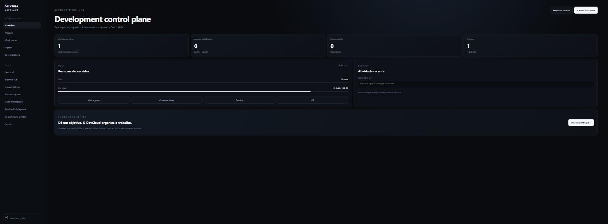
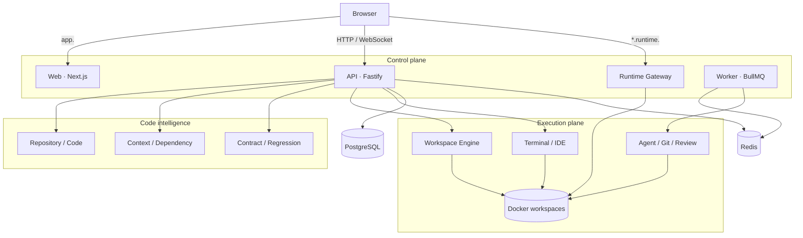
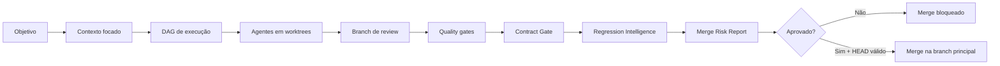
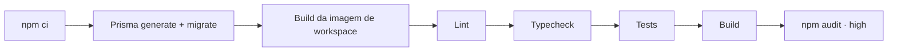
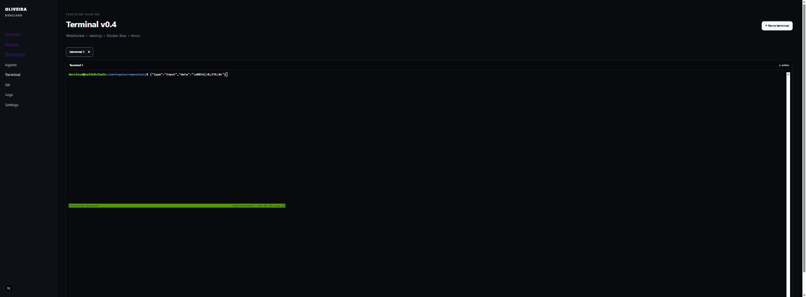
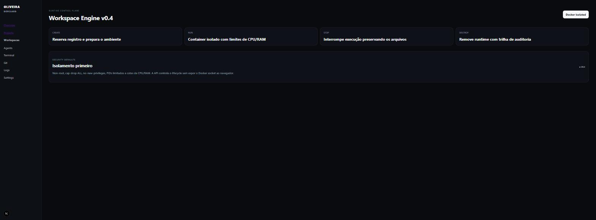
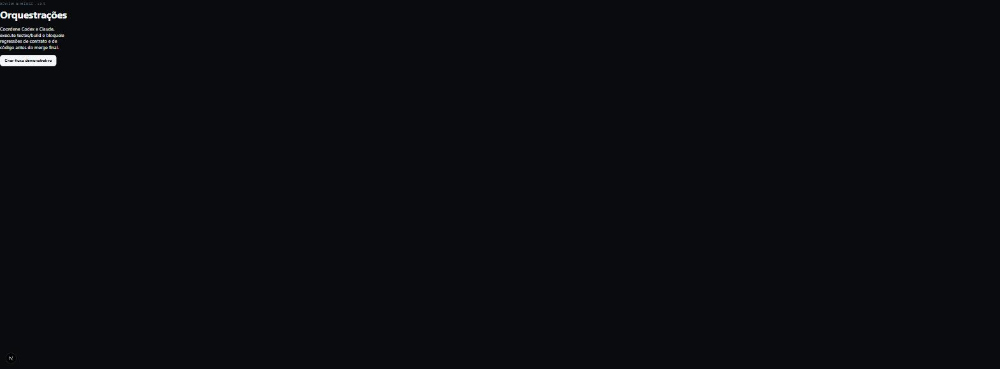

# Oliveira DevCloud

[](https://github.com/RobersonCodes/Oliveira-DevCloud/actions/workflows/ci.yml)


Plataforma self-hosted para provisionar ambientes de desenvolvimento isolados, operar agentes de IA
em paralelo e controlar o caminho entre uma alteração de código e o merge em produção.

Cada projeto é executado em um workspace Docker dedicado, com terminal persistente, IDE no navegador,
Git worktrees por agente e uma etapa de revisão protegida por quality gates, análise de contratos,
avaliação determinística de regressão e aprovação humana.



## Visão geral

A Oliveira DevCloud separa o ambiente de trabalho do desenvolvedor do runtime em que o código é
executado. O navegador acessa apenas o control plane; criação de containers, sessões de terminal,
operações Git e execução de agentes permanecem no backend.

| Capacidade | Implementação |
| --- | --- |
| Workspaces isolados | Containers Docker non-root, com limites de CPU, memória e PIDs |
| Terminal persistente | xterm.js + WebSocket autenticado + tmux no container |
| IDE remota | code-server atrás de Runtime Gateway com origem, ticket e cookie isolados |
| Execução multiagente | Codex e Claude em Git worktrees independentes |
| Orquestração | DAG de tarefas assíncronas processado por BullMQ |
| Contexto de código | Índices de arquivos, símbolos, dependências, endpoints e contratos por commit |
| Review & Merge | Quality gates, Contract Gate, Regression Intelligence e aprovação humana |
| Auditoria e acesso | Sessões com cookies `HttpOnly`, RBAC por organização, activity log e secrets criptografados |

## Arquitetura

O monorepo é dividido em três aplicações e pacotes de domínio com responsabilidades explícitas.
PostgreSQL mantém o estado durável; Redis coordena filas e estado efêmero; Docker hospeda os runtimes
de desenvolvimento.



### Decisões de projeto

- **Control plane separado do execution plane:** o navegador nunca recebe acesso ao Docker socket.
- **Runtime em site registrável separado:** conteúdo não confiável de IDE/preview não compartilha
  origem nem domínio de cookies com o painel; cookies sensíveis usam prefixo `__Host-`.
- **Gateway como fronteira autoritativa:** tickets HMAC curtos, membership revalidada por requisição,
  `Origin` exato em mutações/WebSocket e headers de segurança sobrescrevem respostas do workspace.
- **Isolamento por worktree:** cada agente altera uma árvore Git própria; a integração ocorre apenas na
  branch efêmera de review.
- **Bloqueio baseado em evidência:** falhas objetivas — testes, build, conflitos ou quebra de contrato
  com consumidor conhecido — impedem o merge. Sinais heurísticos alimentam o relatório, mas exigem
  decisão humana.
- **Concorrência otimista no merge:** a aprovação só é aplicada se o `HEAD` da branch principal ainda
  corresponder ao commit capturado no início do review.
- **Infraestrutura real nos testes:** integrações com PostgreSQL e Docker são exercitadas sem fallback
  silencioso para mocks.

Detalhes adicionais estão em [docs/ARCHITECTURE.md](docs/ARCHITECTURE.md).

## Fluxo de Review & Merge



O fluxo mantém alterações automatizadas fora da branch principal até que a integração combinada seja
validada. O relatório final consolida falhas de gates, alterações de contrato, sinais de regressão e
conflitos para que a aprovação seja rastreável.

## Estrutura do repositório

```text
.
├── apps/
│   ├── api/                    # API, autenticação, WebSocket e proxies de runtime
│   ├── web/                    # Dashboard Next.js
│   └── worker/                 # Jobs assíncronos e orquestrações
├── packages/
│   ├── database/               # Schema Prisma e acesso ao PostgreSQL
│   ├── workspace-engine/       # Lifecycle e isolamento de containers
│   ├── terminal-engine/        # Sessões persistentes de terminal
│   ├── git-engine/             # Worktrees, snapshots, diffs e merge
│   ├── orchestrator-engine/    # DAG e estado de execução
│   ├── contract-gate/          # Compatibilidade de contratos HTTP
│   ├── regression-intelligence/ # Detectores e cálculo de risco
│   └── ...                     # Demais módulos de domínio
├── infra/
│   ├── workspace-images/       # Imagens dos ambientes de desenvolvimento
│   └── production/             # Baseline de deploy em host único
├── docs/                       # Arquitetura, decisões e histórico por versão
└── docker-compose.yml          # PostgreSQL e Redis para desenvolvimento
```

## Executando localmente

### Pré-requisitos

- Node.js 22+
- npm 11+
- Docker Engine com Docker Compose
- Git
- Linux ou WSL2 recomendado para acesso ao Docker socket e montagem dos workspaces

### Configuração

1. Instale as dependências e crie o arquivo de ambiente:

   ```bash
   npm ci
   cp .env.example .env
   ```

   No PowerShell, use `Copy-Item .env.example .env`.

2. Gere uma chave de 32 bytes para `SECRETS_MASTER_KEY_BASE64`:

   ```bash
   openssl rand -base64 32
   ```

3. Inicie PostgreSQL e Redis:

   ```bash
   docker compose up -d postgres redis
   ```

4. Construa a imagem usada pelos workspaces:

   ```bash
   docker build -t oliveira-devcloud/workspace-node:1.0 infra/workspace-images/node
   ```

5. Gere o Prisma Client, aplique as migrations e inicie as aplicações:

   ```bash
   npm run db:generate
   npm run db:migrate
   npm run dev
   ```

Após a inicialização:

| Serviço | Endereço |
| --- | --- |
| Dashboard | `http://localhost:3000` |
| API | `http://localhost:4000` |
| PostgreSQL | `localhost:5433` |
| Redis | `localhost:6379` |

As variáveis disponíveis e seus valores de desenvolvimento estão documentados em
[.env.example](.env.example). Credenciais e chaves reais não devem ser versionadas.

## Comandos úteis

| Comando | Finalidade |
| --- | --- |
| `npm run dev` | Inicia web, API e worker em modo de desenvolvimento |
| `npm run build` | Compila todos os workspaces que expõem script de build |
| `npm run typecheck` | Executa o TypeScript em todos os workspaces |
| `npm run lint` | Executa os linters configurados |
| `npm test` | Executa a suíte completa uma vez |
| `npm run test:watch` | Executa os testes em modo interativo |
| `npm run test:browser` | Valida Runtime Gateway em Chromium real |
| `npm run db:generate` | Gera o Prisma Client |
| `npm run db:migrate` | Cria/aplica migrations em desenvolvimento |
| `npm run db:migrate:deploy` | Aplica migrations versionadas em ambientes implantados |

## Estratégia de testes

A suíte combina testes unitários, de integração e end-to-end. Casos dependentes de infraestrutura não
são ignorados quando PostgreSQL ou Docker estão indisponíveis; a falha permanece visível.

| Escopo | Validação | Dependências |
| --- | --- | --- |
| Unitário | Criptografia, RBAC, detectores e cálculo determinístico de risco | Nenhuma |
| Banco de dados | Constraints, cascades e comportamento real do schema Prisma | PostgreSQL |
| API | Registro, login, autorização, organizações, projetos e rate limiting | PostgreSQL |
| Browser | Ticket, redirect, cookies, iframe, headers e WebSocket do Runtime Gateway | PostgreSQL + Chromium |
| Git Engine | Worktree, snapshot, diff, review, merge e cleanup | Docker |
| Workspace Engine | Lifecycle, CPU, memória, PIDs e capabilities | Docker |
| E2E | Login → projeto → workspace → terminal → comando → encerramento | PostgreSQL + Docker |

Os arquivos de teste são executados sem paralelismo entre si para evitar disputa pelos recursos
compartilhados de infraestrutura. Essa escolha favorece determinismo e reprodutibilidade.

## Segurança

A segurança é tratada como fronteira arquitetural, não apenas como validação de interface.

| Controle | Garantia |
| --- | --- |
| Autorização | RBAC por organização (`OWNER` > `ADMIN` > `DEVELOPER`) em rotas sensíveis |
| Sessão | Cookie `__Host-`, `HttpOnly`, `Secure` e `SameSite=Lax` em produção |
| Runtime Gateway | Site separado, cookies `__Host-`, tickets HMAC de 60s e autorização revalidada |
| Conteúdo não confiável | CSP/Permissions/Referrer impostos pelo gateway; `Domain` removido de cookies upstream |
| Segredos | AES-256-GCM em repouso e mascaramento em respostas e logs |
| Containers | Usuário non-root, `CapDrop: ALL`, `no-new-privileges` e limites de recursos |
| Comandos | Argumentos estruturados e allow-list nos quality gates |
| Abuso | Rate limiting global e limites mais restritivos nas rotas de autenticação |
| Auditoria | Registro de atividades e decisões relevantes do fluxo operacional |
| Merge | Aprovação `ADMIN`/`OWNER` e verificação otimista do `HEAD` |

> [!IMPORTANT]
> O Docker socket concede alto privilégio ao processo que o utiliza. Em produção, API e worker devem
> operar em hosts dedicados, com acesso restrito, hardening do daemon e controles de rede externos.
>
> `RUNTIME_BASE_DOMAIN` deve pertencer a um domínio registrável diferente de `DEV_CLOUD_HOST`. Usar
> apenas outro subdomínio preserva riscos de cookie tossing entre conteúdo de runtime e control plane.

## CI

Cada push e pull request executa o workflow [`.github/workflows/ci.yml`](.github/workflows/ci.yml):



O pipeline provisiona PostgreSQL e constrói a imagem real de workspace antes dos testes. Assim, o gate
de integração valida o mesmo tipo de runtime usado pela plataforma.

## Interface

| Terminal persistente | Workspace Engine |
| --- | --- |
|  |  |

| Orquestrações | Autenticação |
| --- | --- |
|  |  |

## Limites operacionais

- O deployment em `infra/production` é uma baseline para host único; alta disponibilidade,
  autoscaling e isolamento multi-host não fazem parte desta versão.
- O Runtime Gateway exige domínio registrável próprio, DNS wildcard, certificado wildcard e server
  block nginx correspondente antes da exposição pública.
- Workspaces dependem de um Docker Engine acessível pela API e pelo worker.
- Planejamento por IA exige credenciais válidas do provedor selecionado; o restante do control plane
  pode operar sem elas.
- Testes de integração exigem PostgreSQL e Docker disponíveis localmente ou no runner de CI.

## Documentação

- [Plano operacional de conclusão](docs/PROJECT-COMPLETION-PLAN.md) — fases executáveis, checkpoint, critérios de aceite e retomada por agentes.
- [Arquitetura](docs/ARCHITECTURE.md) — componentes e fronteiras de segurança.
- [Regression Intelligence v2.5](docs/V2.5.md) — detectores, score e Merge Risk Report.
- [Auditoria v2.5](docs/V2.5-AUDIT.md) — achados de baseline e correções de confiabilidade.
- [Roadmap de hardening](docs/HARDENING-ROADMAP.md) — riscos, decisões e critérios de produção.
- [Deploy do Runtime Gateway](docs/RUNTIME-GATEWAY-DEPLOY.md) — DNS, TLS wildcard e nginx em domínio real.
- [Relatório de implementação v2.5](docs/V2.5-IMPLEMENTATION-REPORT.md) — escopo e validações da versão.
- [`docs/V0.2.md`](docs/V0.2.md) a [`docs/V2.4.md`](docs/V2.4.md) — evolução incremental das capacidades.

## Contribuição

1. Crie uma branch curta a partir de `main`.
2. Mantenha cada pull request restrito a uma mudança coesa.
3. Execute `lint`, `typecheck`, `test` e `build` antes de solicitar revisão.
4. Descreva no PR o risco da alteração, o plano de teste e qualquer validação manual realizada.
5. Não faça merge com gates vermelhos ou sem aprovação humana quando o fluxo protegido for aplicável.

Decisões que alterem fronteiras de segurança, persistência, contratos públicos ou semântica de merge
devem ser acompanhadas de documentação técnica no mesmo pull request.

## Autoria e direitos

O projeto declara autoria e titularidade em [AUTHORS.md](AUTHORS.md), [COPYRIGHT.md](COPYRIGHT.md) e
[NOTICE.md](NOTICE.md). Declarações, guia de registro e evidências de proveniência estão organizados
em [docs/legal](docs/legal/README.md). Componentes de terceiros permanecem sujeitos às licenças dos
respectivos titulares.
