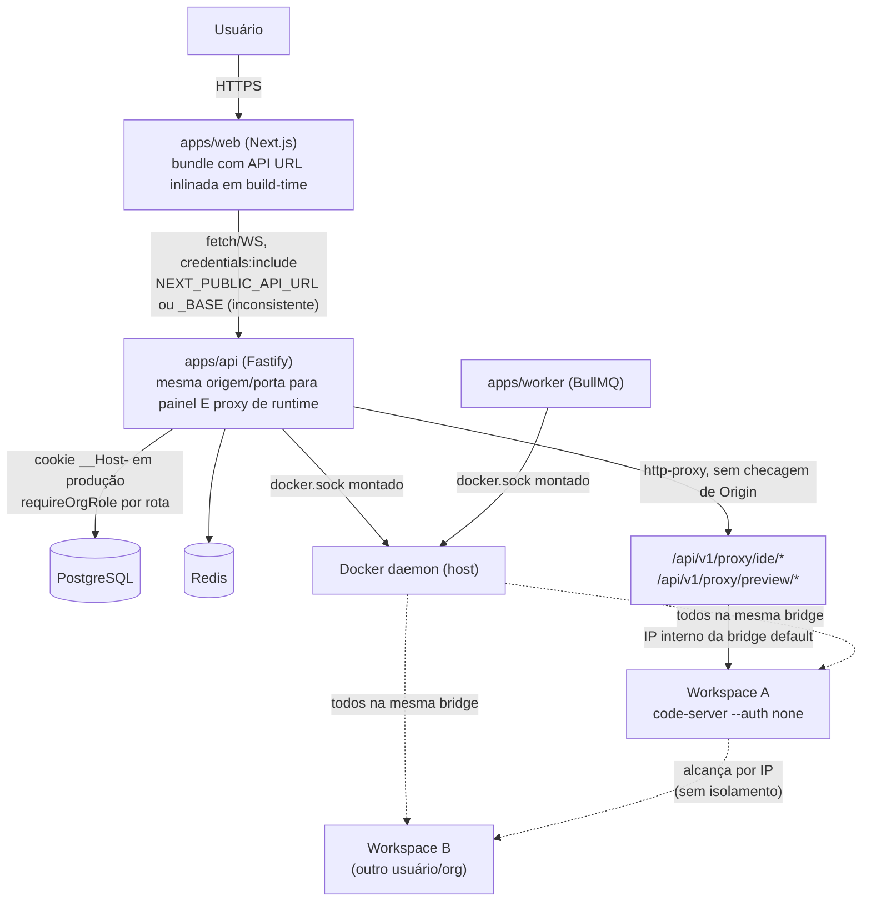

# Hardening Roadmap — Oliveira DevCloud

**Status:** Fase 0 concluída. Dos 15 P0 registrados, todos os 15 foram corrigidos e validados com
evidência real (build, integração, relay WebSocket, Chromium e — a partir desta sessão —
containers/redes Docker reais, localmente e confirmado em CI Linux via push). O Runtime Gateway está
implementado para um site registrável separado do painel, com domínios reais definidos
(`app.aifunnelpro.com.br` / `runtime.tiremax.shop`, DNS já propagado); a VPS de destino é
compartilhada com outro site (Tiremax), então o nginx que termina TLS/roteia é o do próprio host, não
mais um container deste compose — `infra/production/nginx-devcloud.host.conf.example` traz os
server blocks do DevCloud a adicionar ao lado da config existente do Tiremax. HTTP já chega ao nginx
do host; a aplicação real dos server blocks, os certificados TLS e a validação HTTPS/WSS seguem
pendentes no servidor real (`docs/RUNTIME-GATEWAY-DEPLOY.md`). O Runtime Broker (Fase 4,
P1-5) foi implementado e é agora o único detentor de `docker.sock` no sistema — api e worker não têm
mais acesso direto ao daemon. A Fase 1 está concluída; a Fase 5 passou no smoke Linux limpo e resta
parcial somente por credencial externa de agente; a Fase 6 está em andamento, com P1-1/P1-2/P1-3
fechados por allowlist explícita de proxies e boot fail-closed de produção, e as Fases 7-9 seguem
pendentes — ver Seção 7.
**Data:** 2026-08-12
**Método:** leitura direta, execução local e testes de navegador; citações `arquivo:linha`. Nenhuma
afirmação de segurança neste documento é promocional — cada risco listado tem evidência.

## Como ler este documento

- **P0** = explorável/quebra produção hoje, ou perda de dados/isolamento entre tenants. Bloqueia
  publicação na internet.
- **P1** = risco real mas com barreira parcial hoje, ou lacuna que vira P0 sob carga/escala.
- **P2** = dívida técnica, robustez, ou requisito de produto (mobile) sem impacto de segurança
  direto.

Cada risco cita o código exato que o comprova. Onde a mitigação já existe parcialmente, isso está
declarado — este documento não infla achados para parecer mais impressionante.

---

## 1. Fluxo de arquitetura atual

Pontos-chave já confirmados no código:

1. O painel (control plane) e o conteúdo de runtime (IDE/preview de workspace) são servidos **sob
   a mesma origem HTTP** — `apps/api/src/app.ts:83` registra `registerRuntimeProxy(app)` no mesmo
   Fastify app que `/api/v1/auth`, sem separação de domínio/porta
   (`apps/api/src/lib/runtimeProxy.ts:28-47`).
2. Todos os workspaces (de qualquer usuário/organização) compartilham a rede Docker `bridge`
   default (`packages/workspace-engine/src/index.ts:84`, `.env.example:14`) — nenhuma rede
   dedicada por workspace.
3. `docker.sock` está montado em **dois** serviços (`api` e `worker`,
   `infra/production/docker-compose.prod.yml:22,30`), e cada pacote de domínio
   (`workspace-engine`, `terminal-engine`, `ide-engine`, `git-engine`, `agent-engine`,
   `setup-engine`, `review-engine`, `repository-intelligence`, `code-intelligence`,
   `contract-intelligence`) instancia seu próprio cliente Dockerode — não existe um broker central
   nem allow-list de operações.
4. O frontend não usa caminho relativo (`/api/v1/...`); usa URL absoluta inlinada em build-time via
   `NEXT_PUBLIC_API_URL` (13 arquivos) ou `NEXT_PUBLIC_API_BASE` (1 arquivo divergente,
   `apps/web/app/ide/page.tsx:6`) — ambos com fallback `http://localhost:4000` que fica
   hardcoded no bundle se a env var não estiver definida no `docker build`.

---

## 2. Modelo de ameaças

### 2.1 Ativos protegidos

| Ativo | Onde vive hoje |
|---|---|
| Cookie de sessão (`__Host-odc_session` em produção) | `HttpOnly`, `Secure`, `SameSite=Lax`, sem `Domain`; hash SHA-256 em `Session.tokenHash` |
| Secrets de usuário/projeto | AES-256-GCM em repouso (`packages/secret-manager`) |
| Código-fonte dos projetos | bind mount do host em `/workspace` dentro do container |
| Docker socket do host | acesso root-equivalente; hoje em 2 processos (api, worker) |
| Dados de outros tenants (Postgres) | isolado por RBAC de aplicação, não por schema/DB separado |
| Containers de workspace de outros usuários | isolados só por namespace do Docker, não por rede |
| `SECRETS_MASTER_KEY_BASE64` | variável de ambiente, chave mestra de todo o secret-manager |

### 2.2 Atores de ameaça

| Ator | Capacidade assumida |
|---|---|
| **Visitante anônimo na internet** | requisições HTTP/WS diretas à API pública |
| **Usuário autenticado malicioso** | sessão válida em uma organização própria, tenta escalar para outra org/workspace |
| **Código executado dentro de um workspace** (dependência maliciosa do usuário, ou agente de IA comprometido/injeção de prompt) | execução arbitrária dentro do container do workspace, incluindo o code-server `--auth none` |
| **Outro tenant/organização** | usuário legítimo de uma org tentando alcançar dados/containers de outra |
| **Operador/insider com acesso ao host** | fora de escopo de mitigação por software, mas relevante para runbook |

### 2.3 Fronteiras de confiança (estado atual)

| Fronteira | Estado hoje | Evidência |
|---|---|---|
| Browser ↔ Web/API (internet pública) | Autenticada por cookie, CORS single-origin | `apps/api/src/app.ts:41` |
| Painel de controle ↔ Conteúdo de runtime (IDE/preview) | Isolada por origem, site registrável, ticket e cookie `__Host-` | `apps/api/src/lib/runtimeGateway.ts` |
| Workspace ↔ outro Workspace | Isolada — rede Docker dedicada por workspace, sem rota entre redes bridge distintas | `packages/workspace-engine/src/network.ts` |
| Workspace ↔ Docker socket do host | Intacta — socket nunca montado em workspace | confirmado via busca exaustiva (agente de pesquisa) |
| Workspace ↔ Postgres/Redis | Intacta hoje, mas por **acidente de topologia** (redes Compose distintas), não por design explícito | `infra/production/docker-compose.prod.yml` sem `networks:` compartilhada |
| API/Worker ↔ Docker daemon | Isolada — só o `runtime-broker` tem `docker.sock`; api/worker falam com ele via HTTP/WS autenticado, contrato estreito sem `Privileged`/mounts/rede arbitrários | `apps/runtime-broker/`; `infra/production/docker-compose.prod.yml` (Fase 4) |
| code-server dentro do workspace | **Sem autenticação própria** (`--auth none`) — depende 100% do proxy da API | `packages/ide-engine/src/index.ts:55` |

---

## 3. Riscos priorizados

### P0 — bloqueia publicação / quebra produção / rompe isolamento entre tenants

| # | Status | Risco | Evidência |
|---|---|---|---|
| P0-1 | ✅ Corrigido | **Bind mount de workspace resolve para path errado em produção.** `docker-compose.prod.yml` monta o volume nomeado `workspace_data` em `/var/lib/oliveira-devcloud/workspaces` *dentro* dos containers `api`/`worker`, mas `workspace-engine` usa esse mesmo path para pedir ao **daemon do host** (via `docker.sock`) que faça um bind mount — o daemon resolve o path no filesystem do **host**, onde ele não existe. Resultado: containers de workspace novos recebem `/workspace` vazio/errado em produção. O CI já contorna isso setando `WORKSPACE_ROOT` para um path real do host (comentário em `.github/workflows/ci.yml`), mas a baseline de produção nunca foi corrigida. Corrigido trocando o volume nomeado por um bind mount de `${WORKSPACE_ROOT_HOST}` (novo, documentado em `.env.production.example`); validado com `docker compose config`. | `infra/production/docker-compose.prod.yml`; `packages/workspace-engine/src/index.ts:41,85` |
| P0-2 | ✅ Corrigido (app + nginx, validado em navegador real e sintaxe real) / ⏳ DNS+cert+validação em domínio real dependem de execução no servidor do usuário | **Painel e conteúdo de runtime compartilhavam a mesma origem.** O Runtime Gateway agora serve IDE/preview em hosts exclusivos de um `RUNTIME_BASE_DOMAIN` que, em produção, deve pertencer a outro domínio registrável. Um ticket HMAC bearer de 60s é trocado por cookie `__Host-`, host-only, `Secure` e `SameSite=None`; membership e papel são revalidados em toda requisição. WebSocket e mutações exigem `Origin` próprio exato; GET/HEAD tratam corretamente a ausência legítima desse header e usam Fetch Metadata como defesa adicional. CSP, `Referrer-Policy`, `Permissions-Policy` e `nosniff` são impostos tanto no redirect quanto na resposta efetivamente copiada pelo proxy. O proxy remove `X-Frame-Options` conflitante e qualquer atributo `Domain` recebido em `Set-Cookie` upstream. `/api/v1/proxy/*` retorna 410 em produção. Validado com integração e Chromium real, inclusive iframe, redirect, assets, WebSocket e ataque sibling com cookie da vítima. | `apps/api/src/lib/{runtimeGateway.ts,runtimeTicket.ts}`; `apps/api/src/runtimeGateway.test.ts`; `apps/api/e2e-browser/runtimeGateway.spec.ts` |
| P0-3 | ✅ Corrigido | **Todos os workspaces compartilhavam a rede Docker bridge default — sem isolamento entre tenants.** Cada workspace agora recebe sua própria rede Docker dedicada (`odc-ws-net-<workspaceId>`, driver `bridge`), criada/removida de forma idempotente e nunca compartilhada entre workspaces — Docker não roteia entre redes bridge distintas por padrão, o que é o que efetivamente bloqueia o acesso cross-workspace por IP. O Runtime Gateway (relay) é conectado apenas à rede do workspace que está servindo no momento, via `docker network connect`/`disconnect` ao redor de create()/destroy(), identificado em produção por `RELAY_CONTAINER_NAME`/`container_name: odc-api`. Validado com Docker real (Docker Desktop, não CI) neste host: dois workspaces reais, um não consegue nem abrir uma conexão TCP para uma porta com listener ativo no outro; `create()` reaproveita a mesma rede em chamadas repetidas; `destroy()` remove container+rede sem tocar na rede de outro workspace e é idempotente; o relay é conectado/desconectado corretamente; `pruneOrphanedNetworks()` remove só redes rotuladas com zero containers. `Privileged=false`, ausência de `docker.sock` no workspace e `CapDrop:['ALL']`/`no-new-privileges` já existiam e seguem cobertos pelos testes existentes. | `packages/workspace-engine/src/network.ts`; `packages/workspace-engine/src/index.ts`; `packages/workspace-engine/src/network.test.ts`; `packages/ide-engine/src/index.ts`; `infra/production/docker-compose.prod.yml` |
| P0-4 | ✅ Corrigido | **Nenhum WebSocket (terminal, IDE proxy, preview proxy) validava o header `Origin`.** Qualquer site na internet podia tentar abrir uma conexão WS contra a API do usuário logado (o cookie é enviado automaticamente pelo browser em `SameSite=Lax` para WS same-site/top-level); não havia defesa em profundidade além da checagem de sessão. Corrigido com `wsOrigin.ts` (comparação exata contra `WEB_ORIGIN`, nunca por sufixo/prefixo) aplicado a terminal e runtime proxy; papel `DEVELOPER` agora também exigido no WS do runtime proxy (antes só checava membership); ambos migrados para `preHandler` de modo que a validação — Origin, sessão, papel, workspace — sempre roda antes de qualquer 101 (ver P0-13). 18 testes cobrindo origin ausente/maliciosa (com domínios parecidos), cookie ausente/inválido/expirado, cross-org. | `apps/api/src/lib/wsOrigin.ts`; `apps/api/src/routes/terminals.ts`; `apps/api/src/lib/runtimeProxy.ts` |
| P0-5 | ✅ Corrigido | **Rotas de métricas do host são públicas, sem autenticação.** `GET /api/v1/system/metrics-summary` e `GET /api/v1/system` não chamam `requireUser`/`requireOrgRole` — expõem CPU, load average, memória, disco e contagem de workspaces/agentes ativos para qualquer requisição anônima. Corrigido com `requireHostAdmin` e allowlist explícita `HOST_ADMIN_EMAILS`; papéis de organização não concedem acesso global. Testes cobrem anônimo, OWNER de tenant não autorizado e operador configurado. | `apps/api/src/routes/system.ts`; `apps/api/src/app.ts`; `apps/api/src/lib/auth.ts` |
| P0-6 | ✅ Corrigido | **Migrations do Prisma nunca rodam automaticamente em produção.** Nem o `CMD` do `Dockerfile.api` nem `docker-compose.prod.yml` executam `prisma migrate deploy` — um host limpo sobe a API contra um schema vazio. Corrigido com serviço `migrate` one-shot (`depends_on: service_completed_successfully`); validado de ponta a ponta contra Postgres vazio usando a imagem real. | `infra/production/docker-compose.prod.yml` |
| P0-7 | ✅ Corrigido | **Nginx de produção não substitui `${DEV_CLOUD_HOST}`.** O arquivo é montado direto em `/etc/nginx/conf.d/default.conf` (não em `/etc/nginx/templates/*.template`, único mecanismo que dispara `envsubst` na imagem oficial do nginx) — `server_name ${DEV_CLOUD_HOST}` fica literal, quebrando roteamento por host/TLS. Corrigido montando em `/etc/nginx/templates/default.conf.template` + `DEV_CLOUD_HOST` no ambiente do serviço; validado rodando o container real e confirmando a substituição no config renderizado. | `infra/production/nginx.prod.conf`; `infra/production/docker-compose.prod.yml` |
| P0-8 | ✅ Corrigido | **Corrida de concorrência no worker duplica agentes/containers.** O agendamento agora usa deduplicação BullMQ com `keepLastIfActive`, preservando um tick posterior sem executar dois em paralelo para a mesma orquestração. A garantia principal fica no banco: criação do `AgentTask` e claim condicional do step ocorrem na mesma transação, e somente o vencedor inicia efeitos externos. Filas de teste têm nomes aleatórios e nunca limpam a fila de produção. | `packages/orchestrator-engine/src/index.ts`; `packages/orchestrator-engine/src/index.test.ts`; `apps/worker/src/index.ts` |
| P0-9 | ✅ Corrigido | **Cancelar um agente individualmente deixava o step da orquestração travado para sempre.** `POST /cancel` agora sincroniza task, run, step e orquestração na mesma transação. O worker trata `UNKNOWN`, mas suas transições usam compare-and-swap em `status:'RUNNING'`, impedindo que um snapshot antigo sobrescreva `CANCELLED` com `FAILED`. | `apps/api/src/routes/agents.ts`; `apps/worker/src/index.ts` |
| P0-10 | ✅ Corrigido | **Zero graceful shutdown em `apps/api` e `apps/worker`.** Nenhum handler de `SIGTERM`/`SIGINT` existia em nenhum dos dois processos — `docker stop`/rolling deploy matava conexões WS, jobs BullMQ em voo e conexões Prisma/Redis abruptamente. Corrigido com handlers que fecham HTTP/WS, BullMQ Workers, Redis e Prisma, com timeout de força-saída; validado chamando a mesma lógica de fechamento diretamente (sem depender de sinal POSIX, que o Windows não emula fielmente — produção roda em container Linux). | `apps/api/src/index.ts`; `apps/worker/src/index.ts`; `packages/setup-queue/src/index.ts` |
| P0-11 | ✅ Corrigido | **`NEXT_PUBLIC_API_URL`/`NEXT_PUBLIC_API_BASE` nunca eram passadas ao `docker build` do web.** `Dockerfile.web` não declarava `ARG`/`ENV` para essas variáveis; como são inlinadas em build-time pelo Next.js e `env_file` do compose só afeta runtime, o bundle de produção herdava o fallback `http://localhost:4000` de cada `page.tsx`. Corrigido com `ARG`/`ENV` no Dockerfile + `build.args` no compose; validado buildando a imagem real e confirmando **zero** ocorrências de `localhost:4000` no bundle client-side servido (`.next/static`, excluindo source maps). | `infra/production/Dockerfile.web`; `infra/production/docker-compose.prod.yml` |
| P0-12 | ✅ Corrigido | **Divergência `NEXT_PUBLIC_API_URL` vs `NEXT_PUBLIC_API_BASE`.** Treze páginas usavam `NEXT_PUBLIC_API_URL`; só `apps/web/app/ide/page.tsx:6` usava `NEXT_PUBLIC_API_BASE`. Corrigido unificando para `NEXT_PUBLIC_API_URL`. | `apps/web/app/ide/page.tsx:6` |
| P0-13 | ✅ Corrigido | **Conflito entre listeners globais de `upgrade` impedia relay confiável de IDE/preview.** `runtimeProxy.ts` registrava seu próprio `app.server.on('upgrade', ...)` — um listener *global*, não restrito a `/api/v1/proxy/*` — no mesmo `http.Server` em que `@fastify/websocket` **também** registra um listener `upgrade` global (`onUpgrade`, que despacha *qualquer* upgrade pelo roteador completo do Fastify via `fastify.routing()`). Como `/api/v1/proxy/ide/*` e `/api/v1/proxy/preview/*` eram rotas HTTP normais (não `{websocket:true}`), o próprio `@fastify/websocket` completava o handshake (101) e fechava a conexão via seu `noHandle()` interno — **antes** do handler do proxy (que depende de `await` em sessão/Postgres/Docker) conseguir chamar `proxy.ws()`. Confirmado com um cliente HTTP bruto: o 101 chegava ao cliente, e a resposta de rejeição do handler do proxy vazava como bytes soltos por cima da conexão já "aberta". Na prática isso significava que o relay WebSocket de IDE/preview provavelmente nunca funcionou de forma confiável desde que `@fastify/websocket` foi adicionado — independente de qualquer mudança desta sessão. Efeito colateral direto: a checagem de `Origin` do proxy rodava *antes* do match de path nesse mesmo listener global, então também rejeitava incorretamente upgrades de `/api/v1/terminals/*`. **Correção**: removido por completo o listener raw; IDE e preview agora são rotas `wsHandler` explícitas do próprio `@fastify/websocket` (registradas via `app.route({method:'GET', preHandler, handler, wsHandler})`), cujo `preHandler` valida Origin/sessão/papel DEVELOPER/workspace (ou porta registrada, no caso de preview) **antes** de qualquer 101 ser possível — rejeições agora são respostas HTTP normais (401/403/404), nunca handshake seguido de bytes soltos. O relay em si foi extraído para `wsBridge.ts`, reutilizável (texto/binário, propagação de close code com remapeamento de códigos reservados, timeout de conexão ao upstream, guarda de backpressure/`maxPayload`, fila para mensagens do cliente que chegam antes do upstream conectar — bug real encontrado e corrigido durante os testes). Terminal também passou a usar o mesmo padrão `preHandler` para consistência. Validado com 18 testes reais: `app.server.listenerCount('upgrade') === 1`; nenhum byte de rejeição após um 101 (cliente HTTP bruto); relay ponta a ponta de IDE **e** preview contra um servidor WS local real (`internalHost` mockado só na resolução de rede do container, já que não há Docker neste host); 10 testes de `wsBridge` (echo real, texto+binário, propagação/normalização de close code, timeout de conexão, `maxPayload`, backpressure). | `apps/api/src/lib/{runtimeProxy.ts,wsBridge.ts}`; `apps/api/src/routes/terminals.ts`; `apps/api/src/ws-security.test.ts`; `apps/api/src/lib/wsBridge.test.ts` |
| P0-14 | ✅ Corrigido | **Runtime sibling podia plantar cookie com `Domain` no control plane.** Origem diferente não é fronteira de cookie quando painel e runtimes compartilham o domínio registrável. A configuração de produção agora exige outro site registrável; cookies de sessão e runtime usam prefixo `__Host-`, e o proxy remove `Domain` de cookies upstream. | `.env.production.example`; `apps/api/src/{lib/auth.ts,routes/auth.ts,lib/runtimeGateway.ts}` |
| P0-15 | ✅ Corrigido | **Headers de segurança podiam ser sobrescritos pelo container.** `http-proxy` copia headers upstream depois do handler; defini-los apenas em `reply.raw` não era autoritativo. O gateway agora reescreve `proxyRes.headers`, remove `X-Frame-Options` e possui E2E com upstream deliberadamente hostil. | `apps/api/src/lib/runtimeGateway.ts`; `apps/api/e2e-browser/runtimeGateway.spec.ts` |

### P1 — risco real, mitigação parcial ou depende de configuração correta

| # | Risco | Evidência |
|---|---|---|
| P1-1 | ✅ **Corrigido (Fase 6, 2026-08-11; revalidado em 2026-08-12).** `trustProxy:true` foi substituído por uma allowlist `TRUSTED_PROXY_CIDRS` de endereços/CIDRs IPv4/IPv6 validada no boot. Configuração vazia desabilita confiança em proxy; valores inválidos abortam o boot. Conexões diretas ou peers fora da allowlist não conseguem alterar `request.ip`, protocolo ou host com `X-Forwarded-*`; a resolução também para no primeiro salto não confiável. O runbook e o smoke descobrem e fixam somente o `/32` do gateway da rede Compose. Regressão local: 10/10; CI Linux `31528430998` verde; smoke Linux limpo `31528431019` confirmou no `AuditLog` o IP encaminhado somente através do peer confiável. | `apps/api/src/{app.ts,lib/trustedProxy.ts,trusted-proxy.test.ts}`; `.env.production.example`; `docs/PRODUCTION-OPERATIONS.md`; `scripts/production-clean-host-smoke.sh` |
| P1-2 | ✅ **Corrigido (Fase 6, 2026-08-12; commit `c593287`).** A imagem da API fixa `NODE_ENV=production` e `SECURE_CONFIG_REQUIRED=true`; antes de criar o Fastify, a aplicação exige ambos os estados, portanto ausência/override acidental de `NODE_ENV` não degrada silenciosamente o cookie `__Host-odc_session` para um cookie sem `Secure`. O boot também valida TTL e configuração criptográfica. Regressões confirmam a falha de `buildApp()` em configuração insegura e as propriedades `Secure`, `Path=/`, ausência de `Domain` e prefixo `__Host-`. CI Linux `31620694690` e smoke limpo `31620699908` verdes. | `infra/production/Dockerfile.api`; `apps/api/src/lib/{productionConfig.ts,productionConfig.test.ts,auth.ts,auth.test.ts}` |
| P1-3 | ✅ **Corrigido (Fase 6, 2026-08-12; commit `c593287`).** O fallback `http://localhost:3000` permanece apenas em desenvolvimento. Em modo seguro de produção, o boot exige `WEB_ORIGIN` como origem HTTPS exata, sem path/query/credenciais, e com hostname idêntico a `DEV_CLOUD_HOST`; também rejeita domínio de runtime local/malformado, placeholders e endpoints obrigatórios inválidos. Erros citam somente os nomes das variáveis. CI Linux `31620694690` e smoke limpo `31620699908` verdes. | `apps/api/src/lib/{productionConfig.ts,productionConfig.test.ts}`; `.env.production.example`; `docs/PRODUCTION-OPERATIONS.md` |
| P1-4 | Handshake WS do `runtimeProxy` verifica apenas membership na organização do workspace, não o papel mínimo `DEVELOPER` que as rotas HTTP paralelas exigem — inconsistência de autorização entre HTTP e WS para o mesmo recurso. | `apps/api/src/lib/runtimeProxy.ts:70-71` vs. rotas HTTP com `requireOrgRole(..., Role.DEVELOPER)` |
| P1-5 | ✅ **Corrigido (Fase 4, 2026-08-10).** ~~`docker.sock` montado em **dois** serviços (api e worker) em vez de um broker único — dobra a superfície de um processo com acesso root-equivalente ao host.~~ Novo serviço `runtime-broker` (`apps/runtime-broker`) é agora o único detentor de `docker.sock`; api e worker falam com ele via `@oliveira/runtime-broker-client` (HTTP/WS autenticado por bearer token, contrato estreito e específico por domínio — nunca um passthrough genérico do Docker). `docker compose config` confirma que `docker.sock` só aparece no `runtime-broker`. 12 pontos de acesso direto a `dockerode` migrados (10 catalogados originalmente + 2 achados durante o levantamento: `apps/api/src/lib/repositoryBootstrap.ts` e sua cópia duplicada em `apps/worker`, consolidadas em `packages/repository-bootstrap`). Validado com 13 testes de contrato do broker + testes reais de cada engine migrado + a suíte E2E completa — tudo contra Docker real. Detalhe completo: `docs/PROJECT-COMPLETION-PLAN.md` Fase 4. | `apps/runtime-broker/`; `packages/runtime-broker-client/`; `infra/production/docker-compose.prod.yml` |
| P1-6 | ✅ **Corrigido (Fase 5, 2026-08-10).** Os quatro Dockerfiles de serviço usam `npm ci`, build multi-stage, artefatos compilados dos pacotes internos, `npm prune --omit=dev`, runtime como UID/GID `10001:10001` e `HEALTHCHECK`; `.dockerignore` impede que secrets, `.git`, artefatos locais e documentação entrem no contexto. O build revelou e a correção incluiu dois defeitos que impediriam produção: pacotes internos apontavam `main` para TypeScript não executável e Prisma não detectava OpenSSL na imagem slim. As quatro imagens foram reconstruídas; imports de runtime passaram; `docker image inspect` confirmou UID 10001, comandos e healthchecks. `dockerode` foi atualizado de 4.x para 5.0.1 depois que o build expôs `uuid` vulnerável; `npm audit --omit=dev` e os quatro builds terminaram com zero vulnerabilidades. | `.dockerignore`; `infra/production/Dockerfile.{api,web,worker,runtime-broker}`; `package.json`; manifests dos pacotes internos |
| P1-7 | ✅ **Corrigido (Fase 5, 2026-08-10).** Redis possui healthcheck `redis-cli ping`; API e worker agora aguardam `service_healthy`, assim como já ocorria com PostgreSQL. | `infra/production/docker-compose.prod.yml` |
| P1-8 | ✅ **Corrigido (Fase 5, 2026-08-10).** `/ready` da API exige PostgreSQL, Redis e `/ready` do Runtime Broker; o broker só fica pronto se `docker.ping()` responder. Compose e healthchecks das imagens usam essas rotas, e o web aguarda a API saudável. Validado também na suíte real do broker contra Docker (`14/14`). | `apps/api/src/app.ts`; `apps/runtime-broker/src/{app.ts,app.test.ts}`; `infra/production/docker-compose.prod.yml` |
| P1-9 | ✅ **Corrigido (Fase 5, 2026-08-11).** A tag `workspace-node-v1.1.0` publicou `ghcr.io/robersoncodes/oliveira-devcloud-workspace-node` no workflow run `31445506653`, com provenance e SBOM. O índice OCI `sha256:90bacb592d8278bd7ee91f023220428663fa7087497807806e871004b2377a4a` foi confirmado remotamente e está fixado em `.env.production.example`. O workflow `Production clean-host smoke`, run `31525879533`, partiu de `ubuntu-latest`, autenticou no GHCR, puxou o digest, subiu o Compose de produção e validou migrations, readiness, usuário/projeto/workspace/terminal, UID 10001, restart, persistência de PostgreSQL/Redis/bind e restore isolado de banco/workspace. | `infra/workspace-images/node/Dockerfile`; `.github/workflows/{workspace-image.yml,production-smoke.yml}`; `scripts/production-clean-host-smoke.sh`; `.env.production.example`; `docs/PRODUCTION-OPERATIONS.md` |
| P1-10 | ✅ **Corrigido (Fase 5, 2026-08-10).** A imagem de workspace instala por `npm ci`, a partir de lockfile próprio, Codex CLI `0.147.0` e Claude Code `2.1.226`; versões são verificadas no CI e autoatualização fica desabilitada. A atualização revelou que `--full-auto` não existe mais no Codex atual: `agent-engine` passou a usar explicitamente `--sandbox workspace-write --ask-for-approval never --skip-git-repo-check`, coberto por regressão. Falha local de inicialização marca AgentTask/step/orquestração como `FAILED`, registra erro sanitizado e retorna sem rejeitar o processador BullMQ. Imagem real executada como UID 10001 confirmou as duas CLIs; `npm audit` encontrou zero vulnerabilidades; teste real broker+Docker+tmux passou `2/2`; imagens worker e broker reconstruídas com audit zero. Uma execução autenticada real ainda é critério pendente da Fase 5, mas não é mais ausência de binário nem exceção não tratada. | `infra/workspace-images/node/{package.json,package-lock.json,Dockerfile}`; `packages/agent-engine/src/{index.ts,index.test.ts}`; `apps/worker/src/index.ts`; `.github/workflows/ci.yml` |
| P1-11 | `destroy()` de workspace remove o container mas nunca o diretório do host — leak de armazenamento permanente; não existe cota por workspace nem job de limpeza de órfãos. | `packages/workspace-engine/src/index.ts:97`; ausência de reaper confirmada |
| P1-12 | **Parcialmente mitigado.** A suíte real do broker valida isolamento de rede entre workspaces e `Privileged=false`; `docker compose config` valida `docker.sock` apenas no broker; a Fase 5 inspecionou as quatro imagens de serviço confirmando UID `10001` e executou a imagem de workspace real `1.1.0` confirmando o usuário non-root e a toolchain. Ainda faltam `ReadonlyRootfs` e uma asserção automatizada consolidada para todas essas propriedades. | `apps/runtime-broker/src/app.test.ts`; `infra/workspace-images/node/Dockerfile`; Dockerfiles/Compose de produção |
| P1-13 | ✅ **Corrigido (Fase 1, 2026-08-10).** ~~Frontend não tem módulo central de cliente HTTP/WS — 14 páginas duplicam a mesma lógica; só 1 de 14 trata `401` redirecionando para `/login` (`apps/web/app/projects/page.tsx:5`); as outras 13 falham silenciosamente se a sessão expirar.~~ `apps/web/lib/apiClient.ts` centraliza `apiFetch`/`apiJson` (redirect automático em `401`, exceto em `/api/v1/auth/*`), `apiWebSocket`/`apiWebSocketUrl` (deriva `ws`/`wss` de `window.location`) e `apiEventSource`. Todas as 14 páginas migradas; `NEXT_PUBLIC_API_URL` removido do bundle, do `Dockerfile.web` e do `docker-compose.prod.yml`. Em produção o nginx já roteia `/api/` para a API (same-origin); em dev, `apps/web/next.config.js` faz o rewrite equivalente. Validado com Postgres/Redis/Docker reais nesta sessão: HTTP (GET/POST/JSON/cookie) via proxy, WebSocket de terminal (I/O bidirecional real via tmux) via proxy, e SSE de `setup jobs` (múltiplos eventos reais em stream) via proxy — os três mecanismos confirmados fim a fim. Exceção intencional preservada: `ide/page.tsx` não reescreve a URL de runtime ticket, que é cross-origin por desenho (Fase 2/P0-2). Detalhe completo: `docs/PROJECT-COMPLETION-PLAN.md` Fase 1. | `apps/web/lib/apiClient.ts`; `apps/web/next.config.js`; 14 páginas em `apps/web/app/` |
| P1-14 | Nenhum teste cobre autenticação de WebSocket com cookie ausente/inválido/expirado, ou tentativa de conectar a terminal/workspace de outra organização. | ausência confirmada |
| P1-15 | A fila do `orchestrator-engine` e o cancelamento via API ganharam regressões automatizadas; ainda faltam testes diretos do loop do worker, `setup-queue`, `terminal-engine`, `ide-engine`, `agent-engine` e `review-engine`. | inventário de testes atual |
| P1-16 | Existe um `app/icon.png` estático, mas ainda faltam manifest, variantes Apple/PWA, service worker, viewport/safe-area e navegação mobile substituta onde o desktop é ocultado. | `apps/web/app/icon.png`; `apps/web/app/layout.tsx`; `apps/web/app/styles.css` |
| P1-17 | Nenhum `attempts`/`backoff` configurado em nenhuma fila BullMQ — qualquer falha (transitória ou não) finaliza a orquestração inteira sem retry. | `packages/orchestrator-engine/src/index.ts:50`; `packages/setup-queue/src/index.ts:7` |
| P1-18 | **Achado durante validação real da Fase 1 (2026-08-10), pré-existente e não relacionado à mudança same-origin.** O handler WS de terminal decide entre payload binário e JSON com `Buffer.isBuffer(raw)`, mas a lib `ws` entrega `data` como `Buffer` tanto para frames de texto quanto binários (`isBinary` vem separado, ignorado aqui) — então o branch `Buffer.isBuffer(raw)` é sempre verdadeiro e o parse de `{"type":"input"\|"resize",...}` (o mesmo protocolo que `apps/web/app/terminal/page.tsx` envia em todo keystroke/resize) nunca roda. Cada tecla digitada no terminal real hoje escreve o envelope JSON literal no pty em vez do caractere, e `resize` nunca é aplicado. Confirmado com um servidor `ws` mínimo isolado (`isBinary:false`, `Buffer.isBuffer(data)===true`) e reproduzido fim a fim via WebSocket real através do proxy Next.js contra um container/tmux real. Correção sugerida: usar o segundo argumento `isBinary` do evento `message` (ou `typeof raw === 'string'` se o cliente/servidor forem ajustados para não forçar Buffer) em vez de `Buffer.isBuffer`. Ainda não corrigido — fora do escopo da Fase 1, registrado aqui para tratamento em fase própria. | `apps/api/src/routes/terminals.ts:102-117`; `apps/web/app/terminal/page.tsx:54,68,71` |

### P2 — dívida técnica / robustez / produto, sem exploração direta

| # | Risco |
|---|---|
| P2-1 | ✅ **Corrigido (Fase 5, 2026-08-10).** Os dois caminhos nginx escondem os headers equivalentes dos upstreams e impõem uma política única ao painel: HSTS, CSP restrita a `self` com `frame-src` exclusivo para `*.runtime.tiremax.shop`, `frame-ancestors 'none'`, `X-Frame-Options: DENY`, `Referrer-Policy: no-referrer`, `Permissions-Policy`, `nosniff`, COOP e CORP. O Runtime Gateway permanece separado: só HSTS vem do nginx; CSP/Referrer/Permissions/nosniff continuam autoritativos na API para não quebrar code-server/previews arbitrários. Os caminhos também explicitam timeouts de cliente/upstream e preservam a janela de 3600s necessária a WS/SSE. Regressão textual cobre as duas configs e `nginx -t` real passou em `nginx:1.27-alpine` com certificados descartáveis. |
| P2-2 | `infra/nginx/devcloud.conf` (não referenciado pelo compose) é config morta/confusa — sem TLS, presente no repo sem indicação de status. |
| P2-3 | ✅ **Corrigido (Fase 5, 2026-08-10).** Removido `curl \| sh`: o Dockerfile baixa o tarball oficial do code-server `4.121.0` por arquitetura, valida SHA-256 fixado com `sha256sum --check --strict` e aborta o build em divergência. Build real confirmou o checksum e `code-server --version`. |
| P2-4 | ✅ **Corrigido (Fase 5, 2026-08-10).** Fastify define explicitamente `bodyLimit=1 MiB`, `requestTimeout=30s` (tempo para receber a requisição completa) e `keepAliveTimeout=72s`; o nginx do painel usa o mesmo `client_max_body_size 1m`, `client_header_timeout 10s` e `client_body_timeout 30s`. `connectionTimeout` continua em zero por decisão explícita para não encerrar WebSockets ociosos válidos. O runtime mantém `25m` no nginx por transportar IDE/preview, separado do JSON do control plane. Teste verifica opções reais do servidor e resposta 413 acima de 1 MiB. |
| P2-5 | Sem gerenciamento de sessões (listar/revogar dispositivos), sem MFA/passkeys, sem recuperação de conta/verificação de e-mail. |
| P2-6 | Sem métricas de fila BullMQ (profundidade, tempo por estágio, falhas, retries). |
| P2-7 | 3 padrões de navegação divergentes coexistindo no frontend (dívida de consistência de UI, não é bug de segurança). |
| P2-8 | Sem Playwright/teste de browser algum; sem teste de acessibilidade (axe). |

---

## 4. Decisões arquiteturais propostas (com trade-offs)

Estas são propostas para as Fases 1-9 — nenhuma foi implementada ainda; ficam aqui para alinhamento
antes da execução.

| Decisão | Alternativa considerada | Por que a escolha proposta |
|---|---|---|
| Cliente HTTP/WS same-origin (`/api/v1/...` relativo, WS derivado de `window.location`) em vez de `NEXT_PUBLIC_API_URL` absoluto | Manter URL absoluta e apenas corrigir o build-arg do Dockerfile | Elimina a classe inteira de bugs P0-11/P0-12/divergência de env var; resolve de graça o problema de `SameSite=Lax` cross-site citado em P1; exige que o nginx já rotea `/api/` para a API (`infra/production/nginx.prod.conf:13` já faz isso) |
| Runtime Gateway com subdomínio dedicado (`ide-<id>.runtime.<dominio>`) + ticket de curta duração | Manter proxy sob `/api/v1/proxy/*` só com CSP/sandbox de iframe reforçados | Resolve P0-2 na raiz (isolamento de origem real); a alternativa mais barata (CSP/sandbox) reduz mas não elimina o risco, e o enunciado da missão pede isolamento de origem explicitamente |
| Rede Docker dedicada por workspace | Uma rede compartilhada só entre workspaces (sem API/worker) | Rede por workspace é o único jeito de garantir que workspace A não alcança workspace B por IP; uma rede "compartilhada só entre workspaces" ainda permite isso |
| `runtime-broker` interno com allow-list de operações, único detentor do `docker.sock` | Manter api+worker com socket, adicionando só validação de input | Reduz de 2 para 1 o número de processos com acesso root-equivalente ao host; centraliza auditoria; custo é uma chamada de rede interna a mais por operação Docker |
| Job de migration `one-shot` separado antes do boot da API | `prisma migrate deploy` no entrypoint da própria API | Evita condição de corrida se `api` escalar para múltiplas réplicas (todas tentando migrar ao mesmo tempo); mais simples de auditar em log próprio |
| Volumes Docker nomeados por workspace (via `docker volume create`) em vez de bind mount de path do host | Corrigir só o path do bind mount para um diretório real do host | Volumes nomeados são resolvidos pelo próprio daemon Docker sem ambiguidade de "path visto por quem" — elimina a classe de bug P0-1 permanentemente, não só a instância atual |

---

## 5. Critérios de aceite consolidados (por fase)

- **Fase 1:** nenhuma ocorrência de `http://localhost:4000` no bundle de produção; IDE/terminal/login/dashboard/Command Center usam um único módulo de cliente; build de produção passa; WS funciona sob HTTPS/WSS.
- **Fase 2:** JS de um preview não lê o painel nem faz requisição autenticada com a sessão do control plane; ticket de um workspace não abre outro; ticket expirado é rejeitado; usuário removido da organização perde acesso imediatamente.
- **Fase 3:** dois workspaces reais, um não alcança a IDE/preview do outro (teste automatizado).
- **Fase 4:** API pública não detém `docker.sock` diretamente; broker valida imagem/mounts/capabilities/rede antes de qualquer operação; porta do broker não é publicada na internet.
- **Fase 5:** em host limpo, a documentação permite configurar → obter imagens → migrar → iniciar → criar usuário/projeto/workspace → abrir IDE/terminal → rodar agente → reiniciar serviços sem perder o workspace.
- **Fase 6:** métricas de host exigem `ADMIN`/`OWNER`; `Origin` validado em WS; `trustProxy` restrito ao proxy real; rate limit por usuário além de por IP.
- **Fase 7:** dois ticks concorrentes não duplicam step; cancelamento sempre sincroniza `OrchestrationStep`; heartbeat + recovery cobrem `AgentTask`/`Orchestration`, não só `SetupJob`.
- **Fase 8:** PWA instalável, navegação mobile nunca desaparece sem substituto, touch targets ≥44px, terminal com toolbar de teclas especiais.
- **Fase 9:** cada garantia acima tem teste automatizado que falha se a regressão voltar.

---

## 6. Confirmação de preservação de alterações do usuário

Nenhuma alteração pré-existente do usuário foi tocada, revertida ou sobrescrita. Durante a correção
dos P0 isolados, `git status` mostrou em determinado momento arquivos não rastreados
(`AUTHORS.md`, `COPYRIGHT.md`, `NOTICE.md`, `docs/legal/`, `.tmp-docs/`) gerados por um processo
paralelo do usuário (declaração de autoria/registro no INPI) — foram identificados e deixados
intocados.

---

## 7. Status e próxima etapa recomendada

**Concluído nesta e em sessões anteriores:** dos 15 P0 registrados (12 originais + 3 descobertos
durante o hardening), todos os 15 foram corrigidos, testados e validados com evidência real de
execução — não resta nenhum P0 aberto:

| Correção | Como foi validado |
|---|---|
| P0-1 — bind mount de workspace | `docker compose config` confirma o path do host resolvido corretamente |
| P0-2/P0-14/P0-15 — Runtime Gateway e cookies | 32 testes de integração + 3 em Chromium real: ticket e cookie escopados, membership revogada, `Origin`/Fetch Metadata, relay WS, ataque sibling, prefixos `__Host-`, headers autoritativos contra upstream hostil e remoção de `Domain` em `Set-Cookie` proxied |
| P0-4 — Origin/papel em WebSocket | 18 testes: origin ausente/maliciosa, cookie ausente/inválido/expirado, cross-org |
| P0-5 — métricas do host protegidas | Testes de integração para anônimo, OWNER de tenant e operador da allowlist |
| P0-6 — job de migration | build real da imagem + `prisma migrate deploy` contra Postgres vazio, tabelas confirmadas via `\dt` |
| P0-7 — template do nginx | container nginx real, `envsubst` confirmado no config renderizado |
| P0-8 — deduplicação + claim transacional | Testes em filas Redis isoladas cobrem coalescência, separação entre orquestrações e tick posterior ao job ativo |
| P0-9 — sync de cancelamento de agente | Testes de integração contra Postgres com compare-and-swap, inclusive contra sobrescrever um COMPLETED concorrente |
| P0-10 — graceful shutdown | lógica de fechamento (`app.close`, `prisma.$disconnect`) exercitada diretamente, sem hang/erro |
| P0-11 — env var do build web | build real da imagem, grep confirma zero `localhost:4000` no bundle client-side |
| P0-12 — divergência de nome de env var | typecheck limpo após unificação |
| P0-13 — conflito de listeners `upgrade` | 18 testes: `listenerCount('upgrade')===1`, nenhum byte pós-101, relay real de IDE **e** preview ponta a ponta, 10 testes de `wsBridge` (echo real, close code, timeout, backpressure) |
| P0-3 — rede Docker dedicada por workspace | 6 testes com Docker real (Docker Desktop, host Windows deste agente — primeira vez que este repositório valida contra um daemon Docker real fora do CI Linux): duas redes distintas por dois workspaces reais; bloqueio de conexão TCP cross-workspace contra uma porta com listener real; reaproveitamento idempotente da rede em `create()` repetido; `destroy()` remove container+rede sem afetar a rede de outro workspace e é idempotente (bug real encontrado e corrigido: a 2ª chamada a `destroy()` lançava 404 porque `container.remove()` não tratava "already gone"); relay conectado/desconectado corretamente na rede certa; `pruneOrphanedNetworks()` remove só rede órfã rotulada. Suíte existente de `workspace-engine` (8 testes) e `git-engine` (3 testes) também rodaram contra esse mesmo daemon real e passaram sem regressão. Confirmado depois em CI Linux real (GitHub Actions, run [31383975282](https://github.com/RobersonCodes/Oliveira-DevCloud/actions/runs/31383975282)): os mesmos 6 testes de `network.test.ts` e a suíte de `index.test.ts` passaram em `ubuntu-latest`. |

Typecheck (`npm run typecheck`, monorepo inteiro), lint, build de produção da API (`tsc -p
apps/api/tsconfig.json`), build de produção do web (`next build`) e build dos demais pacotes rodam
limpos.

**Atualização desta sessão (Etapa 1/Fase 3):** ao contrário das sessões anteriores, este host Windows
tinha o Docker Desktop instalável mas não iniciado; ele foi iniciado nesta sessão, o que tornou
possível — pela primeira vez neste repositório fora do CI Linux — rodar a suíte inteira contra
Postgres, Redis **e** Docker reais (Postgres/Redis efêmeros via `docker run`, migrations aplicadas de
verdade, imagem `oliveira-devcloud/workspace-node:1.0` buildada de verdade). Resultado: 164 de 166
testes passaram. As únicas 2 falhas (`apps/api/src/ws-security.test.ts`, casos "passes Origin/cookie/
role checks (fails later, resolving the real container)" para IDE e preview) foram isoladas com
`git stash` e comprovadamente **pré-existentes e não relacionadas à Fase 3**: falham identicamente no
código antes de qualquer mudança desta sessão, porque o teste espera `500` para um `containerId` de
fixture inexistente, mas com um daemon Docker real alcançável o erro que `dockerode` propaga já vem
com `statusCode: 404` (Fastify honra esse status automaticamente) — um pressuposto do teste sobre o
formato do erro num ambiente sem Docker algum, não uma regressão de rede/isolamento. Registrado aqui
como um defeito de teste conhecido para quem revisitar P0-4/P0-13 ou a Fase 9; não bloqueia a Fase 3.
Nenhuma outra regressão foi introduzida; a contagem exata de cada execução fica registrada no
relatório do commit/CI para não congelar números que mudam a cada novo teste.

Confirmado depois em CI Linux real via push (`gh run` [31383975282](https://github.com/RobersonCodes/Oliveira-DevCloud/actions/runs/31383975282),
`ubuntu-latest`, Postgres/Redis como service containers, Docker real do runner): `typecheck` e `lint`
verdes; `Test` — 163 aprovados, 2 falhas, 1 ignorado (166 no total) — exatamente o mesmo par de
falhas pré-existentes descrito acima e nenhuma outra. Como consequência dessas 2 falhas, o job
`quality` terminou vermelho e `Build`/`Security audit` não chegaram a rodar nessa run — problema
separado da Fase 3, registrado aqui para acompanhamento futuro (P0-4/P0-13 ou Fase 9), não uma
regressão desta mudança.

**Runtime Gateway (P0-2) — o que foi implementado:**
- `apps/api/src/lib/runtimeTicket.ts` — ticket assinado (HMAC-SHA256), stateless, TTL de 60s.
- `apps/api/src/lib/runtimeGateway.ts` — rota de emissão (`POST /api/v1/runtime-tickets`, no painel,
  autenticada normalmente) + rota `constraints:{host: regex}` do próprio Fastify para
  `*.<RUNTIME_BASE_DOMAIN>`, que troca ticket por cookie `__Host-` host-only na primeira
  requisição, remove o ticket da URL via redirect 302, e **revalida membership da organização em toda
  requisição** (não só na troca do ticket) — remover o usuário derruba o acesso imediatamente mesmo
  com cookie de runtime ainda dentro do TTL.
- Headers de segurança autoritativos no domínio de runtime: `Content-Security-Policy: frame-ancestors
  <WEB_ORIGIN>; connect-src 'self'`, `Referrer-Policy: no-referrer`, `Permissions-Policy` e `nosniff`.
  Eles são reescritos em `proxyRes`, portanto o container não pode enfraquecê-los; `Domain` também é
  removido de todo `Set-Cookie` upstream.
- `apps/api/src/lib/runtimeProxy.ts` (a origem antiga, compartilhada) depreciado, bloqueado com 410
  quando `NODE_ENV=production`, ainda funcional em dev durante a transição.
- `apps/web/app/ide/page.tsx` migrado para solicitar ticket antes de montar a IDE/abrir previews;
  iframe com `sandbox` mínimo documentado linha a linha.
- **Checagem estrita de `Origin`**, separada por tipo de requisição: WebSocket e métodos mutantes
  (POST/PUT/PATCH/DELETE) exigem `Origin` igual ao host de destino exato, sem exceção; GET/HEAD
  aceita `Origin` ausente (com `Sec-Fetch-Site`/`Sec-Fetch-Mode` como sinal secundário) porque o Fetch
  Standard não garante esse header em navegação — a versão anterior, que exigia `Origin` uniformemente,
  teria devolvido 403 na navegação real do `<iframe src="...">`. Nunca comparação por sufixo/prefixo.
  Corrigida em duas revisões sucessivas depois que a primeira versão (sem checagem nenhuma, raciocínio
  de que host-only+SameSite=Lax bastariam) se provou vulnerável a um workspace sibling reusar o cookie
  válido de outro via `SameSite` comparando *site* (domínio registrável), não origem exata — ver
  evidência detalhada na tabela de P0 acima. Justificativa completa no comentário de
  `requireRuntimeAccess()`/`validateOriginForGetOrHead()`.
- **Cookie do runtime `__Host-`, `SameSite=None; Secure`** — necessário porque produção usa um site
  registrável separado para conteúdo não confiável. O prefixo impede cookie tossing com `Domain`.
- **Headers impostos em `reply.raw` e em `proxyRes.headers`**, com `X-Frame-Options` removido. A dupla
  aplicação cobre redirect/hijack e impede que uma resposta controlada pelo workspace sobrescreva a
  política do gateway.

**Suíte de navegador real:** `apps/api/e2e-browser/runtimeGateway.spec.ts`, rodada via
`npx playwright test` dentro de `apps/api` (config em `apps/api/playwright.config.ts`; requer
`npx playwright install chromium` uma vez). Deliberadamente separada de `vitest` — sobe a API real
numa porta efêmera, um servidor HTTP+WS real fazendo de "code-server" na porta `IDE_PORT`, e um
servidor HTTP real (não `context.route()` fake) fazendo de painel, porque uma origem puramente
interceptada é tratada pelo Local Network Access do Chrome como espaço de endereço ambíguo e tem
suas requisições a um alvo loopback bloqueadas (`net::ERR_BLOCKED_BY_LOCAL_NETWORK_ACCESS_CHECKS`) —
mais um comportamento que só aparece contra um browser de verdade.

**Atualização — Etapa 2 (2026-08-10):** o usuário forneceu os dois domínios registráveis reais desta
implantação — painel `app.oliveiradevcloud.com`, runtime `runtime.oliveiradevcloud-content.com`
(confirmadamente sites registráveis distintos, não subdomínios do mesmo domínio). Com isso:

- `infra/production/nginx.prod.conf` ganhou o server block real do Runtime Gateway: redirect
  HTTP→HTTPS compartilhado para os dois hosts, server block HTTPS dedicado para
  `*.${RUNTIME_BASE_DOMAIN}` com certificado próprio (`certs/runtime/`), Host header preservado sem
  reescrita (a app despacha por Host via `constraints` do Fastify — `runtimeHostPattern()` em
  `runtimeGateway.ts`), suporte a WebSocket (`Upgrade`/`Connection`) e HSTS (o único header que a app
  não define para esse domínio; CSP/Referrer-Policy/Permissions-Policy/nosniff continuam vindo
  exclusivamente da app, conforme o design do P0-15). A location morta `/runtime/` que existia sob o
  domínio do painel — sem nenhuma rota correspondente na app — foi removida.
- `infra/production/docker-compose.prod.yml`: serviço `nginx` ganhou `RUNTIME_BASE_DOMAIN` no
  `environment` (necessário para o `envsubst` do template); documentado o layout esperado de
  `certs/panel/` e `certs/runtime/` (dois certificados independentes).
- `.env.production.example` e `.env.production` (local, fora do git) atualizados com os domínios
  reais.
- `.gitignore`: `infra/production/certs/` adicionado explicitamente — chave privada TLS nunca deve
  chegar perto do git.
- **Validado nesta sessão** (Docker real, Windows/PowerShell — `docker run` com certificados
  autoassinados descartáveis e `--add-host api/web` simulando a rede do compose): o template renderiza
  os dois domínios reais corretamente via `envsubst`, e `nginx -t` passa sem nenhum warning ou erro
  (inclusive corrigida a diretiva `listen ... http2` depreciada na sintaxe do nginx 1.27, substituída
  por `listen ... ssl;` + `http2 on;` separados). Isso prova a sintaxe e a resolução dos upstreams —
  **não** prova DNS/TLS/roteamento reais, que exigem o servidor de produção.
- Novo runbook: `docs/RUNTIME-GATEWAY-DEPLOY.md` — registros DNS exatos, comandos `certbot` (HTTP-01
  para o painel, DNS-01 obrigatório para o wildcard do runtime), layout de cópia dos certificados,
  renovação/deploy-hook, checklist de validação no domínio real e tabela de recuperação de falha.

**Atualização — domínios trocados e VPS confirmada compartilhada (2026-08-10):** os domínios reais
mudaram de `app.oliveiradevcloud.com`/`runtime.oliveiradevcloud-content.com` para
`app.aifunnelpro.com.br`/`runtime.tiremax.shop` (continuam sendo dois sites registráveis distintos,
requisito do P0-2 preservado). DNS dos três nomes (painel, base do runtime e wildcard) já propagou e
foi confirmado externamente. Também ficou confirmado que a VPS de destino já hospeda outro site
(Tiremax) atrás de um nginx do sistema ocupando 80/443 — isso muda uma decisão arquitetural da Fase 2
que antes assumia uma VPS exclusiva:

- `infra/production/docker-compose.prod.yml` não publica 80/443 nem roda nginx próprio por padrão;
  `web`/`api` publicam só em `127.0.0.1` (`DEVCLOUD_WEB_HOST_PORT`/`DEVCLOUD_API_HOST_PORT`).
- Dois novos arquivos para o nginx **já existente no host**, ao lado da config do Tiremax, sem
  sobrescrevê-la: `nginx-devcloud.host.bootstrap.conf.example` (config temporária, só HTTP, sem
  nenhuma referência a certificado — resolve o ciclo em que a config final não sobe porque referencia
  certificados que só existem depois do desafio HTTP-01, mas o desafio HTTP-01 precisa que algo já
  esteja servindo `/.well-known/acme-challenge/`) e `nginx-devcloud.host.conf.example` (config final,
  aplicada só depois dos dois certificados emitidos, nunca junto com o bootstrap — os dois ativos ao
  mesmo tempo criariam server blocks HTTP conflitantes para o mesmo host).
  `infra/production/nginx.prod.conf` (nginx dockerizado) continua **executável**, não é config morta:
  virou o serviço `nginx` do compose atrás de um profile (`docker compose --profile standalone-nginx
  up -d`, off por padrão) para uma eventual VPS exclusiva futura — não é o caminho usado nesta
  implantação compartilhada.
- Certificado do painel passa a usar desafio HTTP-01 via **webroot** (não `--standalone`, que exigia
  porta 80 livre — não é mais o caso). O wildcard do runtime continua via DNS-01, inalterado.
- Ambos os arquivos de nginx do host (e o dockerizado) ganharam
  `proxy_set_header X-Forwarded-For $proxy_add_x_forwarded_for` nos blocos de API e runtime, com nota
  ligando à restrição de `trustProxy: true` já planejada para a Fase 6/Etapa 6 (Codex) — ver P1-1
  logo abaixo; o header por si só não corrige P1-1, só passa a existir para a app poder ler.
- **Correção de rumo (revisão do usuário):** uma hipótese anterior de bloqueio por firewall
  (Hostinger/hPanel) foi descartada e removida do plano/roadmap/runbook — Drop é a política implícita
  padrão da Hostinger (não uma regra extra em conflito de ordem), a porta 22 fechada externamente é
  intencional neste servidor, e uma requisição para `app.aifunnelpro.com.br` abriu o Tiremax, o que só
  é possível com a porta 80 alcançável e o nginx do host processando a requisição normalmente (caiu no
  `default_server` do Tiremax só por faltar um `server_name` dedicado ao DevCloud). O bloqueio real
  sempre foi só a ausência dos server blocks/certificados/deploy, nunca conectividade de rede.
- `.env.production(.example)`, `docs/ARCHITECTURE.md` e este roadmap atualizados com os domínios e a
  nova topologia. Nenhuma mudança foi aplicada na VPS em si por esta sessão — sem acesso SSH ao
  servidor, todo esse trabalho é preparação de config/documentação para o usuário (ou uma sessão com
  acesso real ao terminal do servidor) aplicar e validar. Validado nesta sessão: `git diff --check`
  limpo, `docker compose config` resolve sem erro (nginx off por padrão, `web`/`api` só em
  `127.0.0.1`), `nginx -t` do bootstrap (sem certificados) e da config final (com certificados
  autoassinados descartáveis) ambos limpos.

**Segue pendente — depende exclusivamente do servidor real do usuário, fora do alcance desta
sessão:** aplicar o bootstrap e depois a config final nos server blocks do host (§2 e §4 do runbook);
emitir os dois certificados TLS via `certbot` (§3, webroot para o painel); subir a stack real e
percorrer a checklist de validação do runbook (§7) — inclusive a captura de rede confirmando que o
cookie do painel nunca é enviado ao domínio de runtime e vice-versa, e que o Tiremax continua
funcionando normalmente durante e depois da mudança.

**Pendente no roadmap geral:** nenhum P0 aberto (todos os 15 corrigidos). A Fase 5 permanece parcial
somente pelo smoke autenticado de agente com credencial externa; a Fase 6 está em andamento e
P1-1/P1-2/P1-3 foram fechados. Permanecem P1/P2 de identidade, sessão, resiliência e produto,
além das Fases 7-9. Dentro da Fase 3, o agendamento
periódico do reaper de redes órfãs (`pruneOrphanedNetworks`), deliberadamente adiado para a Fase 7
(item já registrado no checklist da Fase 3 como permitido: "criar reaper... ou documentar sua entrega
na Fase 7"); dentro da Fase 4, o teste de indisponibilidade do broker também foi deliberadamente
adiado para a Fase 7 pelo mesmo motivo (já listado no próprio checklist dela).

A sequência vigente é a do plano operacional: preservar os bloqueios externos das Fases 2/5 e
avançar a Fase 6 pelo rate limit por identidade e IP, seguida das demais etapas 6-9.

**Marco de CI (Fase 4, 2026-08-10):** run
[31394449630](https://github.com/RobersonCodes/Oliveira-DevCloud/actions/runs/31394449630) do
workflow `CI` é a primeira vez neste projeto em que o job `quality` inteiro passa 100% verde —
`Lint`, `Typecheck`, `Test` (189/189), `Build` e `Security audit`, todos ✓. As três suítes Docker
que a Fase 0 documentava como bloqueadas em CI (`git-engine`, `workspace-engine`, `e2e.test.ts`)
rodam de verdade e passam.
