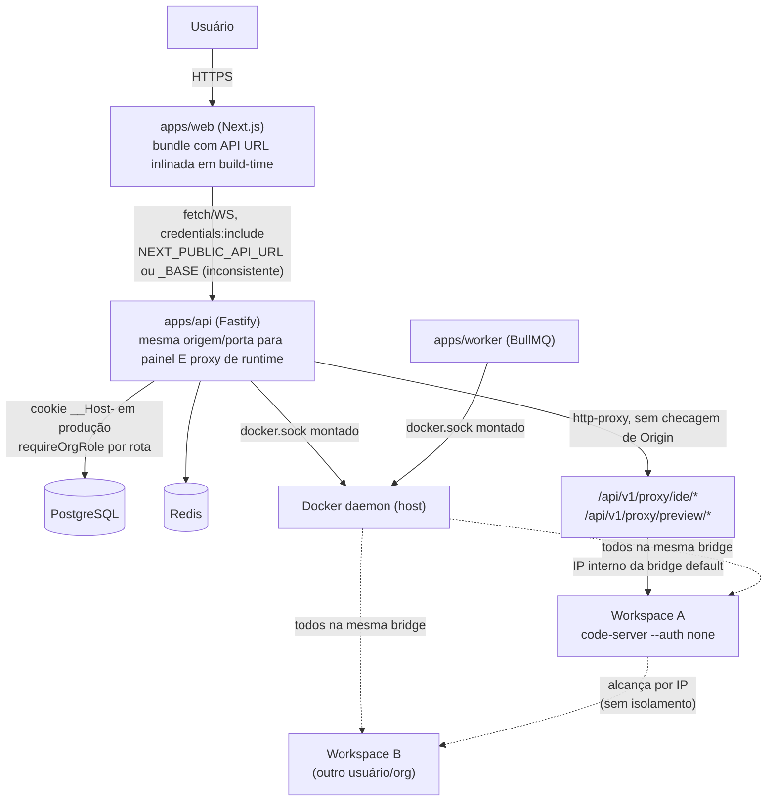

# Hardening Roadmap — Oliveira DevCloud

**Status:** Fase 0 concluída. Dos 15 P0 registrados, 13 foram corrigidos e validados com evidência
real (build, integração, relay WebSocket e Chromium). O Runtime Gateway está implementado para um
site registrável separado do painel; DNS/certificado wildcard/nginx ficam para o deploy real. P0-3
(rede Docker dedicada por workspace) e as Fases 1, 5(resto), 6-9 continuam pendentes — ver Seção 7.
**Data:** 2026-08-10
**Método:** leitura direta, execução local e testes de navegador; citações `arquivo:linha`. Nenhuma
afirmação de segurança neste documento é promocional — cada risco listado tem evidência.

## Como ler este documento

- **P0** = explorável/quebra produção hoje, ou perda de dados/isolamento entre tenants. Bloqueia
  publicação na internet.
- **P1** = risco real mas com barreira parcial hoje, ou lacuna que vira P0 sob carga/escala.
- **P2** = dívida técnica, robustez, ou requisito de produto (mobile) sem impacto de segurança
  direto.

Cada risco cita o código exato que o comprova. Onde a mitigação já existe parcialmente, isso está
declarado — este documento não infla achados para parecer mais impressionante.

---

## 1. Fluxo de arquitetura atual

Pontos-chave já confirmados no código:

1. O painel (control plane) e o conteúdo de runtime (IDE/preview de workspace) são servidos **sob
   a mesma origem HTTP** — `apps/api/src/app.ts:83` registra `registerRuntimeProxy(app)` no mesmo
   Fastify app que `/api/v1/auth`, sem separação de domínio/porta
   (`apps/api/src/lib/runtimeProxy.ts:28-47`).
2. Todos os workspaces (de qualquer usuário/organização) compartilham a rede Docker `bridge`
   default (`packages/workspace-engine/src/index.ts:84`, `.env.example:14`) — nenhuma rede
   dedicada por workspace.
3. `docker.sock` está montado em **dois** serviços (`api` e `worker`,
   `infra/production/docker-compose.prod.yml:22,30`), e cada pacote de domínio
   (`workspace-engine`, `terminal-engine`, `ide-engine`, `git-engine`, `agent-engine`,
   `setup-engine`, `review-engine`, `repository-intelligence`, `code-intelligence`,
   `contract-intelligence`) instancia seu próprio cliente Dockerode — não existe um broker central
   nem allow-list de operações.
4. O frontend não usa caminho relativo (`/api/v1/...`); usa URL absoluta inlinada em build-time via
   `NEXT_PUBLIC_API_URL` (13 arquivos) ou `NEXT_PUBLIC_API_BASE` (1 arquivo divergente,
   `apps/web/app/ide/page.tsx:6`) — ambos com fallback `http://localhost:4000` que fica
   hardcoded no bundle se a env var não estiver definida no `docker build`.

---

## 2. Modelo de ameaças

### 2.1 Ativos protegidos

| Ativo | Onde vive hoje |
|---|---|
| Cookie de sessão (`__Host-odc_session` em produção) | `HttpOnly`, `Secure`, `SameSite=Lax`, sem `Domain`; hash SHA-256 em `Session.tokenHash` |
| Secrets de usuário/projeto | AES-256-GCM em repouso (`packages/secret-manager`) |
| Código-fonte dos projetos | bind mount do host em `/workspace` dentro do container |
| Docker socket do host | acesso root-equivalente; hoje em 2 processos (api, worker) |
| Dados de outros tenants (Postgres) | isolado por RBAC de aplicação, não por schema/DB separado |
| Containers de workspace de outros usuários | isolados só por namespace do Docker, não por rede |
| `SECRETS_MASTER_KEY_BASE64` | variável de ambiente, chave mestra de todo o secret-manager |

### 2.2 Atores de ameaça

| Ator | Capacidade assumida |
|---|---|
| **Visitante anônimo na internet** | requisições HTTP/WS diretas à API pública |
| **Usuário autenticado malicioso** | sessão válida em uma organização própria, tenta escalar para outra org/workspace |
| **Código executado dentro de um workspace** (dependência maliciosa do usuário, ou agente de IA comprometido/injeção de prompt) | execução arbitrária dentro do container do workspace, incluindo o code-server `--auth none` |
| **Outro tenant/organização** | usuário legítimo de uma org tentando alcançar dados/containers de outra |
| **Operador/insider com acesso ao host** | fora de escopo de mitigação por software, mas relevante para runbook |

### 2.3 Fronteiras de confiança (estado atual)

| Fronteira | Estado hoje | Evidência |
|---|---|---|
| Browser ↔ Web/API (internet pública) | Autenticada por cookie, CORS single-origin | `apps/api/src/app.ts:41` |
| Painel de controle ↔ Conteúdo de runtime (IDE/preview) | Isolada por origem, site registrável, ticket e cookie `__Host-` | `apps/api/src/lib/runtimeGateway.ts` |
| Workspace ↔ outro Workspace | **Violada — mesma rede bridge** | `packages/workspace-engine/src/index.ts:84` |
| Workspace ↔ Docker socket do host | Intacta — socket nunca montado em workspace | confirmado via busca exaustiva (agente de pesquisa) |
| Workspace ↔ Postgres/Redis | Intacta hoje, mas por **acidente de topologia** (redes Compose distintas), não por design explícito | `infra/production/docker-compose.prod.yml` sem `networks:` compartilhada |
| API/Worker ↔ Docker daemon | **Privilégio não reduzido** — 2 processos com socket bruto, sem broker/allow-list | `infra/production/docker-compose.prod.yml:22,30` |
| code-server dentro do workspace | **Sem autenticação própria** (`--auth none`) — depende 100% do proxy da API | `packages/ide-engine/src/index.ts:55` |

---

## 3. Riscos priorizados

### P0 — bloqueia publicação / quebra produção / rompe isolamento entre tenants

| # | Status | Risco | Evidência |
|---|---|---|---|
| P0-1 | ✅ Corrigido | **Bind mount de workspace resolve para path errado em produção.** `docker-compose.prod.yml` monta o volume nomeado `workspace_data` em `/var/lib/oliveira-devcloud/workspaces` *dentro* dos containers `api`/`worker`, mas `workspace-engine` usa esse mesmo path para pedir ao **daemon do host** (via `docker.sock`) que faça um bind mount — o daemon resolve o path no filesystem do **host**, onde ele não existe. Resultado: containers de workspace novos recebem `/workspace` vazio/errado em produção. O CI já contorna isso setando `WORKSPACE_ROOT` para um path real do host (comentário em `.github/workflows/ci.yml`), mas a baseline de produção nunca foi corrigida. Corrigido trocando o volume nomeado por um bind mount de `${WORKSPACE_ROOT_HOST}` (novo, documentado em `.env.production.example`); validado com `docker compose config`. | `infra/production/docker-compose.prod.yml`; `packages/workspace-engine/src/index.ts:41,85` |
| P0-2 | ✅ Corrigido (app, validado em navegador real) / ⏳ nginx+DNS+cert pendentes | **Painel e conteúdo de runtime compartilhavam a mesma origem.** O Runtime Gateway agora serve IDE/preview em hosts exclusivos de um `RUNTIME_BASE_DOMAIN` que, em produção, deve pertencer a outro domínio registrável. Um ticket HMAC bearer de 60s é trocado por cookie `__Host-`, host-only, `Secure` e `SameSite=None`; membership e papel são revalidados em toda requisição. WebSocket e mutações exigem `Origin` próprio exato; GET/HEAD tratam corretamente a ausência legítima desse header e usam Fetch Metadata como defesa adicional. CSP, `Referrer-Policy`, `Permissions-Policy` e `nosniff` são impostos tanto no redirect quanto na resposta efetivamente copiada pelo proxy. O proxy remove `X-Frame-Options` conflitante e qualquer atributo `Domain` recebido em `Set-Cookie` upstream. `/api/v1/proxy/*` retorna 410 em produção. Validado com integração e Chromium real, inclusive iframe, redirect, assets, WebSocket e ataque sibling com cookie da vítima. | `apps/api/src/lib/{runtimeGateway.ts,runtimeTicket.ts}`; `apps/api/src/runtimeGateway.test.ts`; `apps/api/e2e-browser/runtimeGateway.spec.ts` |
| P0-3 | ⏳ Pendente | **Todos os workspaces compartilham a rede Docker bridge default — sem isolamento entre tenants.** Um workspace comprometido alcança por IP qualquer outro workspace de qualquer organização, incluindo seu code-server `--auth none` na porta 13337 (que só não é exposta ao host, mas é alcançável na rede interna). Fase 3. | `packages/workspace-engine/src/index.ts:84`, `packages/ide-engine/src/index.ts:55` |
| P0-4 | ✅ Corrigido | **Nenhum WebSocket (terminal, IDE proxy, preview proxy) validava o header `Origin`.** Qualquer site na internet podia tentar abrir uma conexão WS contra a API do usuário logado (o cookie é enviado automaticamente pelo browser em `SameSite=Lax` para WS same-site/top-level); não havia defesa em profundidade além da checagem de sessão. Corrigido com `wsOrigin.ts` (comparação exata contra `WEB_ORIGIN`, nunca por sufixo/prefixo) aplicado a terminal e runtime proxy; papel `DEVELOPER` agora também exigido no WS do runtime proxy (antes só checava membership); ambos migrados para `preHandler` de modo que a validação — Origin, sessão, papel, workspace — sempre roda antes de qualquer 101 (ver P0-13). 18 testes cobrindo origin ausente/maliciosa (com domínios parecidos), cookie ausente/inválido/expirado, cross-org. | `apps/api/src/lib/wsOrigin.ts`; `apps/api/src/routes/terminals.ts`; `apps/api/src/lib/runtimeProxy.ts` |
| P0-5 | ✅ Corrigido | **Rotas de métricas do host são públicas, sem autenticação.** `GET /api/v1/system/metrics-summary` e `GET /api/v1/system` não chamam `requireUser`/`requireOrgRole` — expõem CPU, load average, memória, disco e contagem de workspaces/agentes ativos para qualquer requisição anônima. Corrigido com `requireHostAdmin` e allowlist explícita `HOST_ADMIN_EMAILS`; papéis de organização não concedem acesso global. Testes cobrem anônimo, OWNER de tenant não autorizado e operador configurado. | `apps/api/src/routes/system.ts`; `apps/api/src/app.ts`; `apps/api/src/lib/auth.ts` |
| P0-6 | ✅ Corrigido | **Migrations do Prisma nunca rodam automaticamente em produção.** Nem o `CMD` do `Dockerfile.api` nem `docker-compose.prod.yml` executam `prisma migrate deploy` — um host limpo sobe a API contra um schema vazio. Corrigido com serviço `migrate` one-shot (`depends_on: service_completed_successfully`); validado de ponta a ponta contra Postgres vazio usando a imagem real. | `infra/production/docker-compose.prod.yml` |
| P0-7 | ✅ Corrigido | **Nginx de produção não substitui `${DEV_CLOUD_HOST}`.** O arquivo é montado direto em `/etc/nginx/conf.d/default.conf` (não em `/etc/nginx/templates/*.template`, único mecanismo que dispara `envsubst` na imagem oficial do nginx) — `server_name ${DEV_CLOUD_HOST}` fica literal, quebrando roteamento por host/TLS. Corrigido montando em `/etc/nginx/templates/default.conf.template` + `DEV_CLOUD_HOST` no ambiente do serviço; validado rodando o container real e confirmando a substituição no config renderizado. | `infra/production/nginx.prod.conf`; `infra/production/docker-compose.prod.yml` |
| P0-8 | ✅ Corrigido | **Corrida de concorrência no worker duplica agentes/containers.** O agendamento agora usa deduplicação BullMQ com `keepLastIfActive`, preservando um tick posterior sem executar dois em paralelo para a mesma orquestração. A garantia principal fica no banco: criação do `AgentTask` e claim condicional do step ocorrem na mesma transação, e somente o vencedor inicia efeitos externos. Filas de teste têm nomes aleatórios e nunca limpam a fila de produção. | `packages/orchestrator-engine/src/index.ts`; `packages/orchestrator-engine/src/index.test.ts`; `apps/worker/src/index.ts` |
| P0-9 | ✅ Corrigido | **Cancelar um agente individualmente deixava o step da orquestração travado para sempre.** `POST /cancel` agora sincroniza task, run, step e orquestração na mesma transação. O worker trata `UNKNOWN`, mas suas transições usam compare-and-swap em `status:'RUNNING'`, impedindo que um snapshot antigo sobrescreva `CANCELLED` com `FAILED`. | `apps/api/src/routes/agents.ts`; `apps/worker/src/index.ts` |
| P0-10 | ✅ Corrigido | **Zero graceful shutdown em `apps/api` e `apps/worker`.** Nenhum handler de `SIGTERM`/`SIGINT` existia em nenhum dos dois processos — `docker stop`/rolling deploy matava conexões WS, jobs BullMQ em voo e conexões Prisma/Redis abruptamente. Corrigido com handlers que fecham HTTP/WS, BullMQ Workers, Redis e Prisma, com timeout de força-saída; validado chamando a mesma lógica de fechamento diretamente (sem depender de sinal POSIX, que o Windows não emula fielmente — produção roda em container Linux). | `apps/api/src/index.ts`; `apps/worker/src/index.ts`; `packages/setup-queue/src/index.ts` |
| P0-11 | ✅ Corrigido | **`NEXT_PUBLIC_API_URL`/`NEXT_PUBLIC_API_BASE` nunca eram passadas ao `docker build` do web.** `Dockerfile.web` não declarava `ARG`/`ENV` para essas variáveis; como são inlinadas em build-time pelo Next.js e `env_file` do compose só afeta runtime, o bundle de produção herdava o fallback `http://localhost:4000` de cada `page.tsx`. Corrigido com `ARG`/`ENV` no Dockerfile + `build.args` no compose; validado buildando a imagem real e confirmando **zero** ocorrências de `localhost:4000` no bundle client-side servido (`.next/static`, excluindo source maps). | `infra/production/Dockerfile.web`; `infra/production/docker-compose.prod.yml` |
| P0-12 | ✅ Corrigido | **Divergência `NEXT_PUBLIC_API_URL` vs `NEXT_PUBLIC_API_BASE`.** Treze páginas usavam `NEXT_PUBLIC_API_URL`; só `apps/web/app/ide/page.tsx:6` usava `NEXT_PUBLIC_API_BASE`. Corrigido unificando para `NEXT_PUBLIC_API_URL`. | `apps/web/app/ide/page.tsx:6` |
| P0-13 | ✅ Corrigido | **Conflito entre listeners globais de `upgrade` impedia relay confiável de IDE/preview.** `runtimeProxy.ts` registrava seu próprio `app.server.on('upgrade', ...)` — um listener *global*, não restrito a `/api/v1/proxy/*` — no mesmo `http.Server` em que `@fastify/websocket` **também** registra um listener `upgrade` global (`onUpgrade`, que despacha *qualquer* upgrade pelo roteador completo do Fastify via `fastify.routing()`). Como `/api/v1/proxy/ide/*` e `/api/v1/proxy/preview/*` eram rotas HTTP normais (não `{websocket:true}`), o próprio `@fastify/websocket` completava o handshake (101) e fechava a conexão via seu `noHandle()` interno — **antes** do handler do proxy (que depende de `await` em sessão/Postgres/Docker) conseguir chamar `proxy.ws()`. Confirmado com um cliente HTTP bruto: o 101 chegava ao cliente, e a resposta de rejeição do handler do proxy vazava como bytes soltos por cima da conexão já "aberta". Na prática isso significava que o relay WebSocket de IDE/preview provavelmente nunca funcionou de forma confiável desde que `@fastify/websocket` foi adicionado — independente de qualquer mudança desta sessão. Efeito colateral direto: a checagem de `Origin` do proxy rodava *antes* do match de path nesse mesmo listener global, então também rejeitava incorretamente upgrades de `/api/v1/terminals/*`. **Correção**: removido por completo o listener raw; IDE e preview agora são rotas `wsHandler` explícitas do próprio `@fastify/websocket` (registradas via `app.route({method:'GET', preHandler, handler, wsHandler})`), cujo `preHandler` valida Origin/sessão/papel DEVELOPER/workspace (ou porta registrada, no caso de preview) **antes** de qualquer 101 ser possível — rejeições agora são respostas HTTP normais (401/403/404), nunca handshake seguido de bytes soltos. O relay em si foi extraído para `wsBridge.ts`, reutilizável (texto/binário, propagação de close code com remapeamento de códigos reservados, timeout de conexão ao upstream, guarda de backpressure/`maxPayload`, fila para mensagens do cliente que chegam antes do upstream conectar — bug real encontrado e corrigido durante os testes). Terminal também passou a usar o mesmo padrão `preHandler` para consistência. Validado com 18 testes reais: `app.server.listenerCount('upgrade') === 1`; nenhum byte de rejeição após um 101 (cliente HTTP bruto); relay ponta a ponta de IDE **e** preview contra um servidor WS local real (`internalHost` mockado só na resolução de rede do container, já que não há Docker neste host); 10 testes de `wsBridge` (echo real, texto+binário, propagação/normalização de close code, timeout de conexão, `maxPayload`, backpressure). | `apps/api/src/lib/{runtimeProxy.ts,wsBridge.ts}`; `apps/api/src/routes/terminals.ts`; `apps/api/src/ws-security.test.ts`; `apps/api/src/lib/wsBridge.test.ts` |
| P0-14 | ✅ Corrigido | **Runtime sibling podia plantar cookie com `Domain` no control plane.** Origem diferente não é fronteira de cookie quando painel e runtimes compartilham o domínio registrável. A configuração de produção agora exige outro site registrável; cookies de sessão e runtime usam prefixo `__Host-`, e o proxy remove `Domain` de cookies upstream. | `.env.production.example`; `apps/api/src/{lib/auth.ts,routes/auth.ts,lib/runtimeGateway.ts}` |
| P0-15 | ✅ Corrigido | **Headers de segurança podiam ser sobrescritos pelo container.** `http-proxy` copia headers upstream depois do handler; defini-los apenas em `reply.raw` não era autoritativo. O gateway agora reescreve `proxyRes.headers`, remove `X-Frame-Options` e possui E2E com upstream deliberadamente hostil. | `apps/api/src/lib/runtimeGateway.ts`; `apps/api/e2e-browser/runtimeGateway.spec.ts` |

### P1 — risco real, mitigação parcial ou depende de configuração correta

| # | Risco | Evidência |
|---|---|---|
| P1-1 | `trustProxy: true` confia cegamente em qualquer proxy upstream — se a API for exposta sem um proxy confiável na frente, `request.ip` (usado em rate-limit e audit log) é falsificável pelo header `X-Forwarded-For` do próprio atacante. | `apps/api/src/app.ts:36` |
| P1-2 | Cookie de sessão só recebe `secure: true` se `NODE_ENV==='production'` estiver setado corretamente no deploy — se a env var faltar, o cookie trafega sem flag `Secure`. | `apps/api/src/routes/auth.ts:40,65` |
| P1-3 | `CORS origin` cai para `http://localhost:3000` se `WEB_ORIGIN` não estiver definida em produção — libera CORS com `credentials:true` para uma origem de desenvolvimento. | `apps/api/src/app.ts:41` |
| P1-4 | Handshake WS do `runtimeProxy` verifica apenas membership na organização do workspace, não o papel mínimo `DEVELOPER` que as rotas HTTP paralelas exigem — inconsistência de autorização entre HTTP e WS para o mesmo recurso. | `apps/api/src/lib/runtimeProxy.ts:70-71` vs. rotas HTTP com `requireOrgRole(..., Role.DEVELOPER)` |
| P1-5 | `docker.sock` montado em **dois** serviços (api e worker) em vez de um broker único — dobra a superfície de um processo com acesso root-equivalente ao host. | `infra/production/docker-compose.prod.yml:22,30` |
| P1-6 | Dockerfiles de produção usam `npm install` (não `npm ci`), são single-stage (copiam o monorepo inteiro, sem `.dockerignore`), rodam como root e não têm `HEALTHCHECK`. | `infra/production/Dockerfile.{api,web,worker}` |
| P1-7 | PostgreSQL já possui healthcheck e bloqueia migration/API/worker corretamente; Redis ainda usa apenas `service_started`, sem healthcheck de prontidão no Compose de produção. | `infra/production/docker-compose.prod.yml` |
| P1-8 | `/ready` só verifica Postgres — não verifica Redis nem o daemon Docker, então o orquestrador de containers pode considerar a API "pronta" mesmo com Redis/Docker fora do ar. | `apps/api/src/app.ts:58-61` |
| P1-9 | Imagem de workspace (`oliveira-devcloud/workspace-node:1.0`) nunca é publicada em registry — precisa ser buildada manualmente em todo host novo, passo operacional não documentado. | ausência confirmada em CI e infra |
| P1-10 | CLIs de agente (Codex/Claude) não são instalados em nenhuma imagem; se ausentes, `agent-engine` lança exceção não tratada dentro do loop de `tick()` do worker. | `packages/agent-engine/src/index.ts:57,62-63`; `apps/worker/src/index.ts:42` (sem try/catch ao redor) |
| P1-11 | `destroy()` de workspace remove o container mas nunca o diretório do host — leak de armazenamento permanente; não existe cota por workspace nem job de limpeza de órfãos. | `packages/workspace-engine/src/index.ts:97`; ausência de reaper confirmada |
| P1-12 | Nenhum teste valida isolamento de rede entre workspaces, `Privileged=false`, `ReadonlyRootfs`, ausência de `docker.sock`, ou non-root real na imagem de produção (os testes de container usam `alpine`, que roda como root por padrão — diferente da imagem real). | `packages/workspace-engine/src/index.test.ts` (escopo confirmado, gaps confirmados) |
| P1-13 | Frontend não tem módulo central de cliente HTTP/WS — 14 páginas duplicam a mesma lógica; só 1 de 14 trata `401` redirecionando para `/login` (`apps/web/app/projects/page.tsx:5`); as outras 13 falham silenciosamente se a sessão expirar. | levantamento completo em apps/web (agente de pesquisa) |
| P1-14 | Nenhum teste cobre autenticação de WebSocket com cookie ausente/inválido/expirado, ou tentativa de conectar a terminal/workspace de outra organização. | ausência confirmada |
| P1-15 | A fila do `orchestrator-engine` e o cancelamento via API ganharam regressões automatizadas; ainda faltam testes diretos do loop do worker, `setup-queue`, `terminal-engine`, `ide-engine`, `agent-engine` e `review-engine`. | inventário de testes atual |
| P1-16 | Existe um `app/icon.png` estático, mas ainda faltam manifest, variantes Apple/PWA, service worker, viewport/safe-area e navegação mobile substituta onde o desktop é ocultado. | `apps/web/app/icon.png`; `apps/web/app/layout.tsx`; `apps/web/app/styles.css` |
| P1-17 | Nenhum `attempts`/`backoff` configurado em nenhuma fila BullMQ — qualquer falha (transitória ou não) finaliza a orquestração inteira sem retry. | `packages/orchestrator-engine/src/index.ts:50`; `packages/setup-queue/src/index.ts:7` |

### P2 — dívida técnica / robustez / produto, sem exploração direta

| # | Risco |
|---|---|
| P2-1 | `nginx.prod.conf` sem CSP, `Referrer-Policy`, `Permissions-Policy`, `frame-ancestors`/`X-Frame-Options`; sem `X-Forwarded-For`; sem `proxy_read_timeout` explícito para WS. |
| P2-2 | `infra/nginx/devcloud.conf` (não referenciado pelo compose) é config morta/confusa — sem TLS, presente no repo sem indicação de status. |
| P2-3 | Instalação do code-server via `curl \| sh` (versão fixada, mas sem verificação de checksum). |
| P2-4 | Sem `bodyLimit`/timeout de servidor HTTP customizados na API (usa defaults do Fastify). |
| P2-5 | Sem gerenciamento de sessões (listar/revogar dispositivos), sem MFA/passkeys, sem recuperação de conta/verificação de e-mail. |
| P2-6 | Sem métricas de fila BullMQ (profundidade, tempo por estágio, falhas, retries). |
| P2-7 | 3 padrões de navegação divergentes coexistindo no frontend (dívida de consistência de UI, não é bug de segurança). |
| P2-8 | Sem Playwright/teste de browser algum; sem teste de acessibilidade (axe). |

---

## 4. Decisões arquiteturais propostas (com trade-offs)

Estas são propostas para as Fases 1-9 — nenhuma foi implementada ainda; ficam aqui para alinhamento
antes da execução.

| Decisão | Alternativa considerada | Por que a escolha proposta |
|---|---|---|
| Cliente HTTP/WS same-origin (`/api/v1/...` relativo, WS derivado de `window.location`) em vez de `NEXT_PUBLIC_API_URL` absoluto | Manter URL absoluta e apenas corrigir o build-arg do Dockerfile | Elimina a classe inteira de bugs P0-11/P0-12/divergência de env var; resolve de graça o problema de `SameSite=Lax` cross-site citado em P1; exige que o nginx já rotea `/api/` para a API (`infra/production/nginx.prod.conf:13` já faz isso) |
| Runtime Gateway com subdomínio dedicado (`ide-<id>.runtime.<dominio>`) + ticket de curta duração | Manter proxy sob `/api/v1/proxy/*` só com CSP/sandbox de iframe reforçados | Resolve P0-2 na raiz (isolamento de origem real); a alternativa mais barata (CSP/sandbox) reduz mas não elimina o risco, e o enunciado da missão pede isolamento de origem explicitamente |
| Rede Docker dedicada por workspace | Uma rede compartilhada só entre workspaces (sem API/worker) | Rede por workspace é o único jeito de garantir que workspace A não alcança workspace B por IP; uma rede "compartilhada só entre workspaces" ainda permite isso |
| `runtime-broker` interno com allow-list de operações, único detentor do `docker.sock` | Manter api+worker com socket, adicionando só validação de input | Reduz de 2 para 1 o número de processos com acesso root-equivalente ao host; centraliza auditoria; custo é uma chamada de rede interna a mais por operação Docker |
| Job de migration `one-shot` separado antes do boot da API | `prisma migrate deploy` no entrypoint da própria API | Evita condição de corrida se `api` escalar para múltiplas réplicas (todas tentando migrar ao mesmo tempo); mais simples de auditar em log próprio |
| Volumes Docker nomeados por workspace (via `docker volume create`) em vez de bind mount de path do host | Corrigir só o path do bind mount para um diretório real do host | Volumes nomeados são resolvidos pelo próprio daemon Docker sem ambiguidade de "path visto por quem" — elimina a classe de bug P0-1 permanentemente, não só a instância atual |

---

## 5. Critérios de aceite consolidados (por fase)

- **Fase 1:** nenhuma ocorrência de `http://localhost:4000` no bundle de produção; IDE/terminal/login/dashboard/Command Center usam um único módulo de cliente; build de produção passa; WS funciona sob HTTPS/WSS.
- **Fase 2:** JS de um preview não lê o painel nem faz requisição autenticada com a sessão do control plane; ticket de um workspace não abre outro; ticket expirado é rejeitado; usuário removido da organização perde acesso imediatamente.
- **Fase 3:** dois workspaces reais, um não alcança a IDE/preview do outro (teste automatizado).
- **Fase 4:** API pública não detém `docker.sock` diretamente; broker valida imagem/mounts/capabilities/rede antes de qualquer operação; porta do broker não é publicada na internet.
- **Fase 5:** em host limpo, a documentação permite configurar → obter imagens → migrar → iniciar → criar usuário/projeto/workspace → abrir IDE/terminal → rodar agente → reiniciar serviços sem perder o workspace.
- **Fase 6:** métricas de host exigem `ADMIN`/`OWNER`; `Origin` validado em WS; `trustProxy` restrito ao proxy real; rate limit por usuário além de por IP.
- **Fase 7:** dois ticks concorrentes não duplicam step; cancelamento sempre sincroniza `OrchestrationStep`; heartbeat + recovery cobrem `AgentTask`/`Orchestration`, não só `SetupJob`.
- **Fase 8:** PWA instalável, navegação mobile nunca desaparece sem substituto, touch targets ≥44px, terminal com toolbar de teclas especiais.
- **Fase 9:** cada garantia acima tem teste automatizado que falha se a regressão voltar.

---

## 6. Confirmação de preservação de alterações do usuário

Nenhuma alteração pré-existente do usuário foi tocada, revertida ou sobrescrita. Durante a correção
dos P0 isolados, `git status` mostrou em determinado momento arquivos não rastreados
(`AUTHORS.md`, `COPYRIGHT.md`, `NOTICE.md`, `docs/legal/`, `.tmp-docs/`) gerados por um processo
paralelo do usuário (declaração de autoria/registro no INPI) — foram identificados e deixados
intocados.

---

## 7. Status e próxima etapa recomendada

**Concluído nesta sessão:** dos 15 P0 registrados (12 originais + 3 descobertos durante o
hardening), 13 foram corrigidos, testados e validados com evidência real de execução:

| Correção | Como foi validado |
|---|---|
| P0-1 — bind mount de workspace | `docker compose config` confirma o path do host resolvido corretamente |
| P0-2/P0-14/P0-15 — Runtime Gateway e cookies | 32 testes de integração + 3 em Chromium real: ticket e cookie escopados, membership revogada, `Origin`/Fetch Metadata, relay WS, ataque sibling, prefixos `__Host-`, headers autoritativos contra upstream hostil e remoção de `Domain` em `Set-Cookie` proxied |
| P0-4 — Origin/papel em WebSocket | 18 testes: origin ausente/maliciosa, cookie ausente/inválido/expirado, cross-org |
| P0-5 — métricas do host protegidas | Testes de integração para anônimo, OWNER de tenant e operador da allowlist |
| P0-6 — job de migration | build real da imagem + `prisma migrate deploy` contra Postgres vazio, tabelas confirmadas via `\dt` |
| P0-7 — template do nginx | container nginx real, `envsubst` confirmado no config renderizado |
| P0-8 — deduplicação + claim transacional | Testes em filas Redis isoladas cobrem coalescência, separação entre orquestrações e tick posterior ao job ativo |
| P0-9 — sync de cancelamento de agente | Testes de integração contra Postgres com compare-and-swap, inclusive contra sobrescrever um COMPLETED concorrente |
| P0-10 — graceful shutdown | lógica de fechamento (`app.close`, `prisma.$disconnect`) exercitada diretamente, sem hang/erro |
| P0-11 — env var do build web | build real da imagem, grep confirma zero `localhost:4000` no bundle client-side |
| P0-12 — divergência de nome de env var | typecheck limpo após unificação |
| P0-13 — conflito de listeners `upgrade` | 18 testes: `listenerCount('upgrade')===1`, nenhum byte pós-101, relay real de IDE **e** preview ponta a ponta, 10 testes de `wsBridge` (echo real, close code, timeout, backpressure) |

Typecheck (`npm run typecheck`, monorepo inteiro), build de produção da API (`tsc -p
apps/api/tsconfig.json`) e build de produção do web (`next build`) rodam limpos. A suíte de testes
(`vitest run`) roda limpa no restante do projeto — os únicos 3 arquivos que falham (`e2e.test.ts`,
`git-engine`, `workspace-engine`) falham pela mesma razão pré-existente e documentada na Fase 0 (sem
relação com as correções acima): este host Windows não tem `/var/run/docker.sock`, então essas
suítes — que já falhavam antes de qualquer mudança desta sessão — continuam falhando exatamente do
mesmo jeito. Nenhuma regressão foi introduzida; a contagem exata da última execução fica registrada
no relatório do commit/CI para não congelar números que mudam a cada novo teste.

**Runtime Gateway (P0-2) — o que foi implementado:**
- `apps/api/src/lib/runtimeTicket.ts` — ticket assinado (HMAC-SHA256), stateless, TTL de 60s.
- `apps/api/src/lib/runtimeGateway.ts` — rota de emissão (`POST /api/v1/runtime-tickets`, no painel,
  autenticada normalmente) + rota `constraints:{host: regex}` do próprio Fastify para
  `*.<RUNTIME_BASE_DOMAIN>`, que troca ticket por cookie `__Host-` host-only na primeira
  requisição, remove o ticket da URL via redirect 302, e **revalida membership da organização em toda
  requisição** (não só na troca do ticket) — remover o usuário derruba o acesso imediatamente mesmo
  com cookie de runtime ainda dentro do TTL.
- Headers de segurança autoritativos no domínio de runtime: `Content-Security-Policy: frame-ancestors
  <WEB_ORIGIN>; connect-src 'self'`, `Referrer-Policy: no-referrer`, `Permissions-Policy` e `nosniff`.
  Eles são reescritos em `proxyRes`, portanto o container não pode enfraquecê-los; `Domain` também é
  removido de todo `Set-Cookie` upstream.
- `apps/api/src/lib/runtimeProxy.ts` (a origem antiga, compartilhada) depreciado, bloqueado com 410
  quando `NODE_ENV=production`, ainda funcional em dev durante a transição.
- `apps/web/app/ide/page.tsx` migrado para solicitar ticket antes de montar a IDE/abrir previews;
  iframe com `sandbox` mínimo documentado linha a linha.
- **Checagem estrita de `Origin`**, separada por tipo de requisição: WebSocket e métodos mutantes
  (POST/PUT/PATCH/DELETE) exigem `Origin` igual ao host de destino exato, sem exceção; GET/HEAD
  aceita `Origin` ausente (com `Sec-Fetch-Site`/`Sec-Fetch-Mode` como sinal secundário) porque o Fetch
  Standard não garante esse header em navegação — a versão anterior, que exigia `Origin` uniformemente,
  teria devolvido 403 na navegação real do `<iframe src="...">`. Nunca comparação por sufixo/prefixo.
  Corrigida em duas revisões sucessivas depois que a primeira versão (sem checagem nenhuma, raciocínio
  de que host-only+SameSite=Lax bastariam) se provou vulnerável a um workspace sibling reusar o cookie
  válido de outro via `SameSite` comparando *site* (domínio registrável), não origem exata — ver
  evidência detalhada na tabela de P0 acima. Justificativa completa no comentário de
  `requireRuntimeAccess()`/`validateOriginForGetOrHead()`.
- **Cookie do runtime `__Host-`, `SameSite=None; Secure`** — necessário porque produção usa um site
  registrável separado para conteúdo não confiável. O prefixo impede cookie tossing com `Domain`.
- **Headers impostos em `reply.raw` e em `proxyRes.headers`**, com `X-Frame-Options` removido. A dupla
  aplicação cobre redirect/hijack e impede que uma resposta controlada pelo workspace sobrescreva a
  política do gateway.

**Suíte de navegador real:** `apps/api/e2e-browser/runtimeGateway.spec.ts`, rodada via
`npx playwright test` dentro de `apps/api` (config em `apps/api/playwright.config.ts`; requer
`npx playwright install chromium` uma vez). Deliberadamente separada de `vitest` — sobe a API real
numa porta efêmera, um servidor HTTP+WS real fazendo de "code-server" na porta `IDE_PORT`, e um
servidor HTTP real (não `context.route()` fake) fazendo de painel, porque uma origem puramente
interceptada é tratada pelo Local Network Access do Chrome como espaço de endereço ambíguo e tem
suas requisições a um alvo loopback bloqueadas (`net::ERR_BLOCKED_BY_LOCAL_NETWORK_ACCESS_CHECKS`) —
mais um comportamento que só aparece contra um browser de verdade.

**Pendente antes de operar o Runtime Gateway com domínio real:** adquirir/configurar um domínio
registrável separado do control plane, DNS wildcard, certificado TLS wildcard e server block em
`nginx.prod.conf`. O exemplo de produção usa `.example.com` no painel e `.example.net` no runtime
justamente para tornar essa fronteira explícita.

**Pendente no roadmap geral:** P0-3 (rede Docker dedicada por workspace — isolamento entre
workspaces na mesma rede `bridge`) e as Fases 1, 5 (o restante), 6-9 por completo.

A sequência sugerida agora é: redes Docker por workspace (P0-3, o último P0) → wiring de nginx/DNS/
certificado real para o Runtime Gateway já pronto → PWA/mobile → testes finais em CI/Linux (onde
`git-engine`/`workspace-engine`/`e2e` finalmente rodam de verdade).
